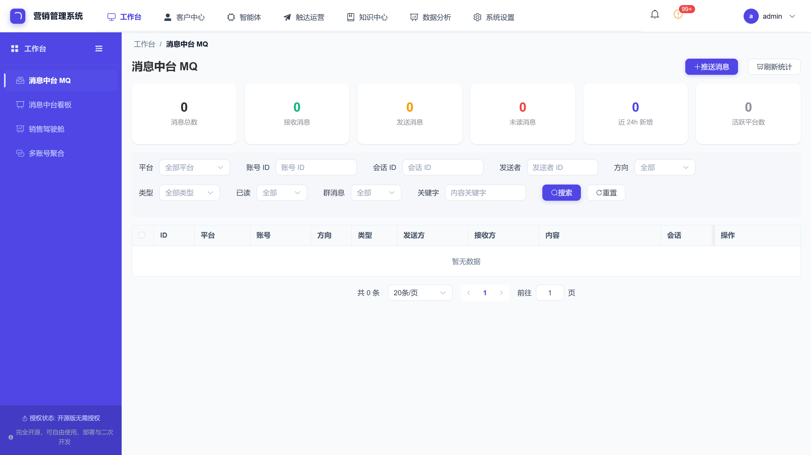
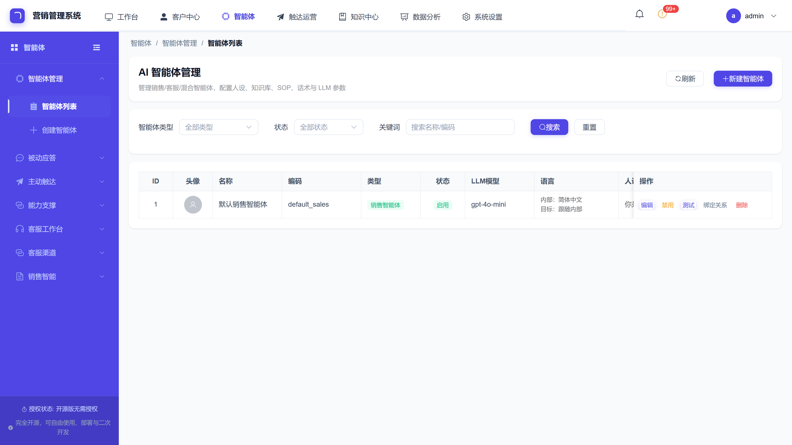
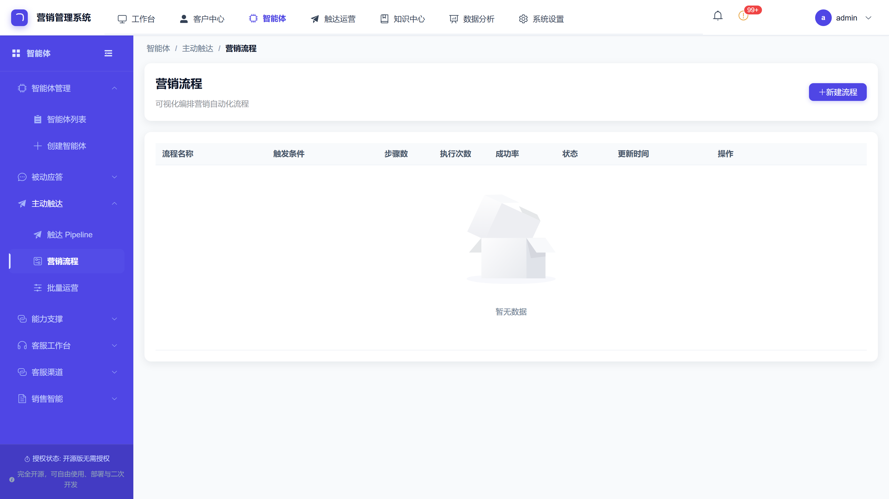
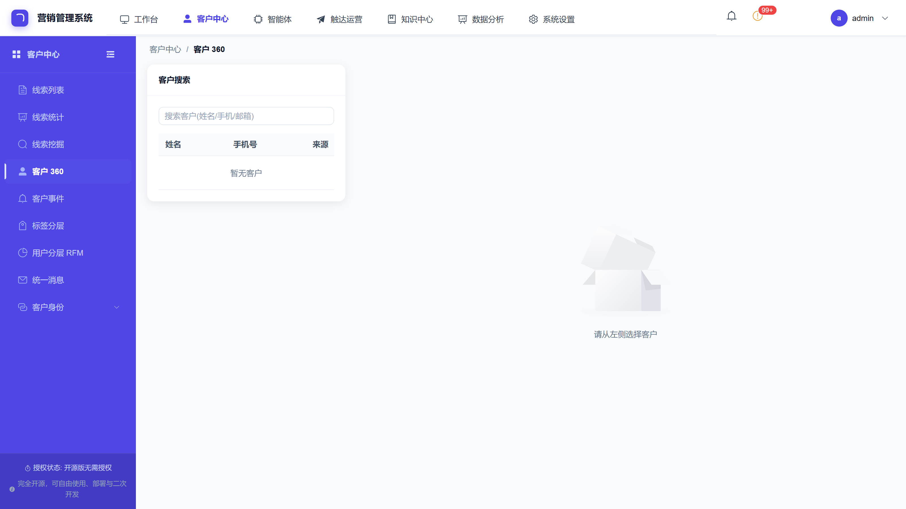
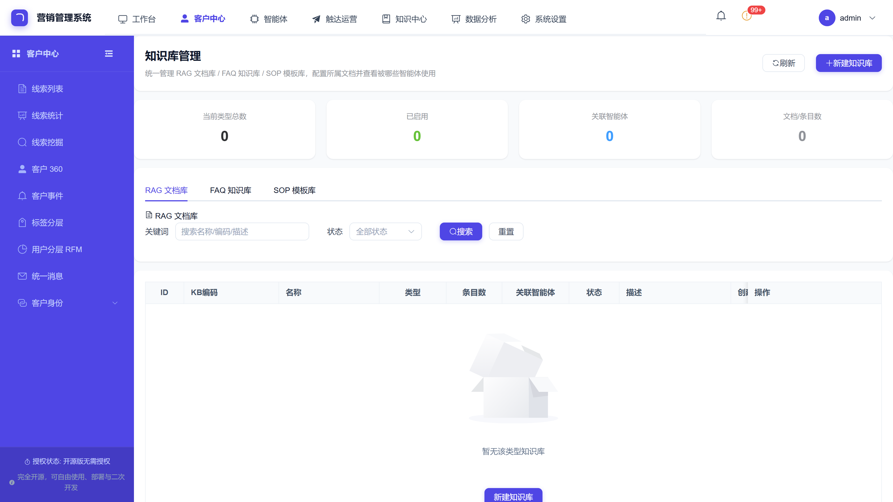

<div align="center">

# 🐝 HiveMtk · 开源私域营销 AI 系统

**把销冠的能力,复制给团队里每一个普通人。**

一个工作台管所有社媒,一个 AI 智能体谈所有客户,数据一寸不出门。

[开源 SCRM](#-与同类项目对比) · [ReAct 自主智能体](#-react-自主智能体不是写死的工作流) · [10+ 渠道触达](#-多端触达一个工作台全管) · [数据零出域](#-数据安全100-私域对话不出客户内网) · [5 分钟自托管部署](#-5-分钟跑起来)

</div>

<div align="center">

[](https://go.dev) [](https://vuejs.org) [](https://www.docker.com) [](https://www.postgresql.org) [](LICENSE) [](https://gitee.com/xhpmayun/hivemtk) [](https://github.com/xiaofang142/hivemtk)

[📖 英文文档](README.en.md) · [🚀 在线体验](#-在线体验) · [📦 功能模块](docs/marketing-features/README.md)

</div>

---

## 数字一览

| | | | |
|---|---|---|---|
| **94** 个业务模块<br>SCRM+AI+CDP+自动化 | **10+** 触达渠道<br>抖音/小红书/TikTok/WhatsApp… | **41** 个智能体工具<br>ReAct 自主编排 | **0** 条数据出域<br>本地推理,零外网可跑 |

---

## 界面一览

| 统一收件箱 | AI 智能体 |
|---|---|
|  |  |
| **营销画布** | **客户 360°** |
|  |  |
| **知识库 RAG** | |
|  | |

---

## 这是什么

**HiveMtk**("Hive"+"Marketing Toolkit")是一套**面向中文私域运营场景的开源 AI 营销系统**,把四件事在同一个仓库里做透:

1. **多端社媒触达** —— 抖音/快手/小红书/闲鱼/TikTok 经 Chrome 扩展桥接,企微/Telegram/WhatsApp/邮件/短信协议直连,统一收件箱
2. **ReAct 自主智能体** —— 感知 → 规划 → 调工具 → 反思,41 个原子工具自主组合,不是写死的 if-else 工作流
3. **本地知识库 RAG** —— pgvector 1024 维混合检索 + bge-m3 + bge-reranker-v2-m3 精排
4. **数据零出域** —— llama.cpp(Qwen2.5)+ TEI 本地推理栈,对话/知识库/向量化全程在客户内网完成

覆盖**获客 → 触达 → 转化 → 复购**全链路。不是"给大模型套个壳",是直接能跑营销业务的完整系统;另附 GEO 模块打通 AI 搜索获客闭环。完整功能列表与已知限制如实披露,见 [docs/marketing-features/README.md](docs/marketing-features/README.md)。

**适合谁**:5–50 人的成长型团队 · 合规敏感行业(金融/医疗/政企)· 不想被 SaaS 厂商锁定的运营团队。

---

## 数字背后的差异

> 诚实对比,敢暴露劣势。**没有银弹**,按需选择。

| 维度 | **HiveMtk**(本项目) | Dify / FastGPT | 商业 SCRM(微伴/尘锋) | 源雀 / MoChat |
|------|--------------------|----------------|---------------------|--------------|
| 核心定位 | 私域营销 AI 系统 | 通用 LLM 应用平台 | 商业 SaaS | 企微 SCRM |
| 触达端 | **多端(10+)** | 无内置 | 1-3 端 | 1 端(企微) |
| AI 能力 | **ReAct 智能体 + 41 工具** | 可视化 Workflow | 基础客服机器人 | 简单 RAG / 无 |
| 数据部署 | **100% 私域 + 本地推理栈** | 自托管 / SaaS | 云端 | SaaS / 私有 |
| 开源协议 | AGPL-3.0 | Apache-2.0 | 闭源 | 部分开源 |
| 适合谁 | 想**自主可控、多端、强 AI** 的团队 | 纯 AI 应用开发 | 无 IT 团队的中小商家 | 企微深度用户 |

---

## 核心能力

### 🌐 多端触达:一个工作台全管

| 渠道 | 触达 | 智能卡片 | 自动回复 | RAG 客服 | 备注 |
|------|------|---------|---------|---------|------|
| 抖音 / 快手 / 小红书 / 闲鱼 / TikTok | ✅ | ✅ | ✅ | ✅ | Chrome 扩展桥接,你自己的登录态浏览器,无需无头浏览器 |
| 微信 / 企业微信 | ✅ | — | ✅ | ✅ | 含社群/朋友圈 |
| Telegram | ✅ | — | ✅ | ✅ | Bot 协议直连,群线索挖掘 + 主动 DM + 入群管控 |
| WhatsApp | ✅ | — | ✅ | ✅ | Cloud API + 模板消息 |
| 邮件 / 短信 | ✅ | — | ✅ | — | SMTP;阿里云/腾讯云/华为云 |

统一 CDP 客户视图,一份资料全渠道触达;统一收件箱,会话/工单/留言一处看完。渠道能力明细与 Telegram 五大获客能力,见 [docs/marketing-features/README.md](docs/marketing-features/README.md)。

### 🤖 ReAct 自主智能体:不是写死的工作流

- **ReAct 循环**:感知 → 规划 → 调工具 → 反思,撞到预设之外的场景也能自己组合工具搞定
- **41 个原子工具**:触达/项目管理/客户/知识库/业务五域,Permission→Retry→Timeout→RateLimit→Audit 五层装饰器逐层包裹
- **混合检索 RAG**:pgvector HNSW + BM25 RRF 融合粗排,bge-reranker 精排,可选 HyDE/MultiQuery 改写
- **多智能体协作**:被动应答智能体 + 主动触达智能体;四层记忆系统(短期/长期/SOP 状态/业务记忆)
- **可视化工作流**:营销自动化编辑器,零代码搭建销冠 SOP

> 工具注册逻辑以源码为准:[user-server/internal/aiagent/agent/tooluse/](user-server/internal/aiagent/agent/tooluse/)(代码即清单)。

### 🔒 数据安全:100% 私域,对话不出客户内网

- **本地推理栈**:llama.cpp(Qwen2.5)+ TEI(bge-m3 + bge-reranker-v2-m3),LLM/Embedding/Rerank 三个 OpenAI 兼容服务跑在客户内网
- **零外网可跑**:对话、知识库、向量化、检索增强全程域内完成
- **FRP 私域穿透**:访客从公网进,数据经隧道回本地,云端不落一条对话
- **合规友好**:满足等保、数据出境管控、私有化部署基线
- **可选云端 LLM**:把 `LLM_BASE_URL` 指向 DeepSeek/OpenAI 即可,Embedding/Rerank 仍强制本地

### 🎯 GEO 智能优化:AI 搜索获客闭环

> SEO 争搜索结果排名,GEO(生成式引擎优化)争 **AI 答案里的"席位"**——让 ChatGPT Search、Perplexity、Google SGE 作答时提及你的品牌。

```
品牌配置 → 关键词蒸馏 → 内容创作 → 多模型验证 → 平台同步发布
                ↑                             ↓
           数据增强 ← 历史验证数据 ←──────────┘
```

关键词蒸馏 · E-E-A-T + Schema 注入 · 多厂商 LLM 模拟 AI 搜索作答量化"席位" · RAG 锚定品牌事实 · 高权重平台同步。完整指南见 [user-server/docs/geo-module-guide.md](user-server/docs/geo-module-guide.md)。

---

## 适用场景

| 场景 | 关键能力 | 典型行业 |
|------|---------|---------|
| 私域获客 → AI 自动谈单 | 多端线索接入 + ReAct 智能体承接咨询 + 异议处理 + 逼单邀约 | 招商加盟 / 医美 / 教培 / B2B |
| 企微 SCRM 多账号聚合 | 多账号统一收件箱 + 客户资产沉淀 + 离职继承 | 连锁门店 / 品牌方 |
| AI 客服 / RAG 知识库 | 混合检索 + 7×24 自动回复 | 电商 / SaaS / 售后 |
| 营销自动化 SOP | 销冠 SOP 可视化编排 + RFM 分层 + 流失预警 + 沉睡激活 | 会员制零售 / 母婴 / 美业 |
| 跨境出海多渠道触达 | TikTok + WhatsApp + 邮件 + Telegram 统一管理 | 跨境电商 / 出海品牌 |
| 合规私有化部署 | 本地推理栈 + 零出域 + 行级权限 + 审计存档 | 金融 / 医疗 / 政企 |

---

## 🚀 5 分钟跑起来

> 唯一要求:Docker 24+ 与 Docker Compose v2。硬件最低 4 核/8GB/50GB(dev 档),推荐 8 核/16GB(prod 档含 14B 模型);GPU 可选,无 GPU 走 CPU 推理。

```bash
# 1. 克隆(国内走 Gitee,海外走 GitHub 镜像)
git clone https://gitee.com/xhpmayun/hivemtk.git && cd hivemtk

# 2. 一键安装:.env 模板 + 构建前后端 + 下载模型 + 拉起数据层与推理栈
make install

# 3. 改 4 个密钥
vim .env   # POSTGRES_PASSWORD / REDIS_PASSWORD / JWT_SECRET / PLATFORM_ADMIN_PASSWORD

# 4. 启动
make dev                    # user-server 热更新 → http://localhost:8204
cd user-web && npm run dev  # 前端工作台 → http://localhost:8211(另开终端)
```

**在线体验**:https://hiveuser.xapptool.cn/ (账号 `admin` / 密码 `Seed@123456`;演示数据公开,请勿上传真实业务数据;以 [Releases](https://gitee.com/xhpmayun/hivemtk/releases) 公告为准)

dev/prod 模型档切换、常见命令、数据库备份恢复等运维细节,见 [docs/DEPLOYMENT_GUIDE.md](docs/DEPLOYMENT_GUIDE.md) 与 [docs/TROUBLESHOOTING.md](docs/TROUBLESHOOTING.md)。

---

## FAQ

**和 Dify / FastGPT 有什么区别?**
HiveMtk 是私域营销系统,聚焦"多端触达 + 销冠 SOP + CDP + 零出域",内置 94 个业务模块开箱即用;Dify/FastGPT 是通用 LLM 应用开发平台,偏 Workflow 编排,不内置营销业务。

**是真的开源吗?可以商用吗?**
✅ AGPL-3.0 完全开源。可自由 fork、私有部署、二次开发、商用。唯一限制:修改后的版本若通过网络对外提供服务(SaaS/云端 API),必须同样按 AGPL-3.0 开源你的修改;仅内部私有部署无需公开。

**数据真的不出域吗?**
✅ 所有对话、知识库、向量化、检索增强全程在客户内网完成。本地推理栈跑在客户内网,FRP 穿透时云端不落一条对话。即使配置云端 LLM,也只传 prompt 文本,PII 本地脱敏后再调用。

**支持哪些大模型?**
✅ DeepSeek / 通义千问 / GPT-4o / 智谱 GLM / 本地 Qwen2.5。LLM 路由网关按场景动态路由:复杂异议用强模型,常规回复用轻模型。Embedding/Rerank 强制本地。

**海外能用吗?**
✅ TikTok + WhatsApp + Telegram + Email 适配跨境出海场景。

**有 SaaS 版吗?**
❌ 不提供。坚持私有化部署、数据自主可控。企业级技术支持/定制集成联系 jideilvluoqun@gmail.com。

---

## 架构一图

```
   访客浏览器(公网)
       │ HTTPS / WSS(经 FRP / 公网 IP / 反代)
       ▼
   ┌─────────────────────────────────────────────────┐
   │  客户本地内网                                    │
   │                                                 │
   │  user-server (Go + Gin) :8204                   │
   │    ├── PostgreSQL + pgvector :8202 (1024 维)     │
   │    └── Redis 7 :8203                            │
   │                                                 │
   │  宿主机推理栈(llama.cpp,非容器化)                │
   │    ├── LLM :8207 (Qwen2.5)                      │
   │    ├── Embedding :8208 (bge-m3)                 │
   │    └── Rerank :8209 (bge-reranker-v2-m3)        │
   │                                                 │
   │  user-web (Vue 3) · embed-sdk(客服 Widget)      │
   └─────────────────────────────────────────────────┘
            │ HTTPS(低频:心跳 / 商户标识校验)
            ▼
   平台端(独立仓库 hivemtk-platform):仅元数据,
   不接触、不存储、不访问任何业务数据
```

后端严格遵循五层架构(Controller → Service → Repository → Model → DTO,禁止跨层调用,CI 强制检查)。完整规范见 [docs/architecture/GO_FIVE_LAYER_ARCHITECTURE.md](docs/architecture/GO_FIVE_LAYER_ARCHITECTURE.md),与平台端的分工见 [docs/architecture/部署方案_用户端.md](docs/architecture/部署方案_用户端.md)。

**技术栈**:Go 1.25 + Gin + GORM · Vue 3 + Vite + Element Plus + Pinia · PostgreSQL 15 + pgvector · Redis 7 · llama.cpp + Qwen2.5 · TEI + bge-m3 / bge-reranker-v2-m3 · Docker Compose。

---

## 仓库结构

```
hivemtk/                        # 用户端仓库
├── user-server/                # Go 后端(核心业务,五层架构)→ user-server/README.md
├── user-web/                   # Vue 3 前端(B 端工作台)→ user-web/README.md
├── embed-sdk/                  # 嵌入式客服 Web Widget(IIFE/ESM)
├── migrations/                 # 数据库迁移 SQL(幂等)
├── scripts/inference-host/     # 宿主机推理栈脚本(llama.cpp + TEI)
├── docs/                       # 文档:INDEX.md / DEPLOYMENT_GUIDE.md / marketing-features/ …
├── docker-compose.yml          # 数据层编排(PG + Redis)
├── Makefile                    # 一键安装/启动/停止/推理栈/开发热更新
└── .env-example                # 环境变量模板
```

---

## 文档导航

| 文档 | 入口 |
|------|------|
| 📖 英文说明 | [README.en.md](README.en.md) |
| 📚 文档索引 | [docs/INDEX.md](docs/INDEX.md) |
| 🚀 部署指南 / 排查手册 | [docs/DEPLOYMENT_GUIDE.md](docs/DEPLOYMENT_GUIDE.md) · [docs/TROUBLESHOOTING.md](docs/TROUBLESHOOTING.md) |
| 📦 94 个功能模块明细 | [docs/marketing-features/README.md](docs/marketing-features/README.md) |
| 🧭 路线图 | [.github/ROADMAP.md](.github/ROADMAP.md) |
| 🤝 贡献指南 / 安全策略 | [CONTRIBUTING.md](CONTRIBUTING.md) · [SECURITY.md](SECURITY.md) |

---

## 合规与免责

主动触达(短信/邮件/社媒私信/Telegram/WhatsApp 等主动推送能力)属于核心敏感功能,本项目作为开源工具不对使用者的调用方式承担责任;每次主动触达发送,服务端日志都会打印不可关闭的 `[COMPLIANCE]` 合规提示。完整声明见 [DISCLAIMER.md](DISCLAIMER.md)([English](DISCLAIMER.en.md))。

**License**:本项目采用 [AGPL-3.0](LICENSE) 发布。私有部署、内部使用、二次开发完全自由、无需开源;修改代码并以 SaaS/云服务/托管 API 对外提供时,必须按 AGPL-3.0 开源修改部分。版权与联系方式见 [NOTICE](NOTICE)。

---

## 联系与社区

| 渠道 | 入口 | 说明 |
|------|------|------|
| 🐛 Bug / Feature Request | [Gitee Issues](https://gitee.com/xhpmayun/hivemtk/issues) / [GitHub Issues](https://github.com/xiaofang142/hivemtk/issues) | 提交问题与建议 |
| 💬 微信交流群 | 通过 Issue / 邮箱申请加入 | 产品/技术/运营答疑,禁止广告/政治/人肉,违者秒踢 |
| 📧 商务合作 / 技术支持 | jideilvluoqun@gmail.com | 企业级技术支持、定制集成、私有部署咨询 |
| 🔒 安全漏洞 | jideilvluoqun@gmail.com | 私密报告,详见 [SECURITY.md](SECURITY.md) |

**镜像仓库**:Gitee 主仓库 [gitee.com/xhpmayun/hivemtk](https://gitee.com/xhpmayun/hivemtk)(国内推荐,下载更快)· GitHub 镜像 [github.com/xiaofang142/hivemtk](https://github.com/xiaofang142/hivemtk)(Actions 定时同步)

---

<div align="center">

⭐ **Star / Watch 一下,跟项目一起成长**

**多端打透 · AI 真自主 · 数据封死在域内**

Made with ❤️ by HiveMtk Team

</div>
