# HiveMtk 工程开发文档总索引

> **规则级别**: ⭐⭐⭐ 项目级硬性约束
> **适用范围**: 所有工程目录的开发文档导航
> **最近更新日期**: 2026-08-27

---

## 一、文档体系说明

HiveMtk 项目按工程目录划分，每个工程目录在 `docs/dev/` 下统一生成 4 份开发文档：

| 文档 | 文件名 | 作用 |
| --- | --- | --- |
| 架构图 | `ARCHITECTURE.md` | 模块结构、调用时序、子系统关系、外部依赖 |
| 代码开发手册 | `DEVELOPMENT.md` | 环境准备、启动命令、目录导航、新增功能流程、构建部署 |
| 代码规范 | `CONVENTIONS.md` | 命名/目录/错误处理/日志/安全/提交规范、禁止清单 |
| 功能清单 | `FEATURES.md` | 按业务域列出全部功能、路由、模块统计 |


---

## 二、工程目录文档导航

### A. 用户端工程（`hivemtk/`）

#### 1. user-server（Go 后端）

Go + Gin + GORM + PostgreSQL + Redis + pgvector，强制五层架构。

| 文档 | 路径 |
| --- | --- |
| 架构图 | [user-server/docs/dev/ARCHITECTURE.md](../user-server/docs/dev/ARCHITECTURE.md) |
| 代码开发手册 | [user-server/docs/dev/DEVELOPMENT.md](../user-server/docs/dev/DEVELOPMENT.md) |
| 代码规范 | [user-server/docs/dev/CONVENTIONS.md](../user-server/docs/dev/CONVENTIONS.md) |
| 功能清单 | [user-server/docs/dev/FEATURES.md](../user-server/docs/dev/FEATURES.md) |

关联架构文档：
- [五层架构编码规范](../docs/architecture/GO_FIVE_LAYER_ARCHITECTURE.md)
- [系统架构图 C4](../docs/architecture/ARCHITECTURE_DIAGRAM.md)

#### 2. user-web（Vue 3 前端）

Vue 3 + Vite + Element Plus + Pinia + Vue Router，用户端 SaaS 前端。

| 文档 | 路径 |
| --- | --- |
| 架构图 | [user-web/docs/dev/ARCHITECTURE.md](../user-web/docs/dev/ARCHITECTURE.md) |
| 代码开发手册 | [user-web/docs/dev/DEVELOPMENT.md](../user-web/docs/dev/DEVELOPMENT.md) |
| 代码规范 | [user-web/docs/dev/CONVENTIONS.md](../user-web/docs/dev/CONVENTIONS.md) |
| 功能清单 | [user-web/docs/dev/FEATURES.md](../user-web/docs/dev/FEATURES.md) |

#### 3. embed-sdk（嵌入式客服 SDK）

原生 JavaScript + Vite，可嵌入第三方网站的客服聊天浮窗 SDK。

| 文档 | 路径 |
| --- | --- |
| 架构图 | [embed-sdk/docs/dev/ARCHITECTURE.md](../embed-sdk/docs/dev/ARCHITECTURE.md) |
| 代码开发手册 | [embed-sdk/docs/dev/DEVELOPMENT.md](../embed-sdk/docs/dev/DEVELOPMENT.md) |
| 代码规范 | [embed-sdk/docs/dev/CONVENTIONS.md](../embed-sdk/docs/dev/CONVENTIONS.md) |
| 功能清单 | [embed-sdk/docs/dev/FEATURES.md](../embed-sdk/docs/dev/FEATURES.md) |

---

### B. 平台端工程（`hivemtk-platform/`，独立仓库）

> 平台端为独立仓库：[Gitee 主仓库](https://gitee.com/xhpmayun/hivemtk-platform) · [GitHub 镜像](https://github.com/xiaofang142/hivemtk-platform)。克隆本仓库时不含该目录；以下文档链接指向 GitHub 在线视图（master 分支）。

#### 4. platform-server（Go 后端）

Go + Gin + GORM + PostgreSQL + Redis，强制五层架构。负责商户管理、心跳接收、安装信息、平台统计、系统监控、商户端 API、站点联系、资产市场·贡献者门户。

| 文档 | 路径 |
| --- | --- |
| 架构图 | [platform-server/docs/dev/ARCHITECTURE.md](https://github.com/xiaofang142/hivemtk-platform/blob/master/platform-server/docs/dev/ARCHITECTURE.md) |
| 代码开发手册 | [platform-server/docs/dev/DEVELOPMENT.md](https://github.com/xiaofang142/hivemtk-platform/blob/master/platform-server/docs/dev/DEVELOPMENT.md) |
| 代码规范 | [platform-server/docs/dev/CONVENTIONS.md](https://github.com/xiaofang142/hivemtk-platform/blob/master/platform-server/docs/dev/CONVENTIONS.md) |
| 功能清单 | [platform-server/docs/dev/FEATURES.md](https://github.com/xiaofang142/hivemtk-platform/blob/master/platform-server/docs/dev/FEATURES.md) |

关联架构文档：
- [平台端系统架构图](https://github.com/xiaofang142/hivemtk-platform/blob/master/docs/architecture/PLATFORM_ARCHITECTURE.md)
- [五层架构编码规范](https://github.com/xiaofang142/hivemtk-platform/blob/master/docs/architecture/GO_FIVE_LAYER_ARCHITECTURE.md)

#### 5. platform-web（Vue 3 前端）

Vue 3 + Vite + Element Plus + Pinia，平台运营管理后台前端。

| 文档 | 路径 |
| --- | --- |
| 架构图 | [platform-web/docs/dev/ARCHITECTURE.md](https://github.com/xiaofang142/hivemtk-platform/blob/master/platform-web/docs/dev/ARCHITECTURE.md) |
| 代码开发手册 | [platform-web/docs/dev/DEVELOPMENT.md](https://github.com/xiaofang142/hivemtk-platform/blob/master/platform-web/docs/dev/DEVELOPMENT.md) |
| 代码规范 | [platform-web/docs/dev/CONVENTIONS.md](https://github.com/xiaofang142/hivemtk-platform/blob/master/platform-web/docs/dev/CONVENTIONS.md) |
| 功能清单 | [platform-web/docs/dev/FEATURES.md](https://github.com/xiaofang142/hivemtk-platform/blob/master/platform-web/docs/dev/FEATURES.md) |

#### 6. platform-contributor（贡献者 Playground）

Vue 3 + Vite + Element Plus，资产市场贡献者中心，支持 5 类资产（agent_persona / sales_script / ab_test_plan / marketing_workflow / industry_sop）的上传、审核、Playground 沙箱调试。

| 文档 | 路径 |
| --- | --- |
| 架构图 | [platform-contributor/docs/dev/ARCHITECTURE.md](https://github.com/xiaofang142/hivemtk-platform/blob/master/platform-contributor/docs/dev/ARCHITECTURE.md) |
| 代码开发手册 | [platform-contributor/docs/dev/DEVELOPMENT.md](https://github.com/xiaofang142/hivemtk-platform/blob/master/platform-contributor/docs/dev/DEVELOPMENT.md) |
| 代码规范 | [platform-contributor/docs/dev/CONVENTIONS.md](https://github.com/xiaofang142/hivemtk-platform/blob/master/platform-contributor/docs/dev/CONVENTIONS.md) |
| 功能清单 | [platform-contributor/docs/dev/FEATURES.md](https://github.com/xiaofang142/hivemtk-platform/blob/master/platform-contributor/docs/dev/FEATURES.md) |

#### 7. website（产品官网）

Vue 3 + Vite + Vue Router，产品官网。包含首页、文档页、FAQ 页，支持多语言、SEO 优化、纯静态构建 + SCP 部署。

| 文档 | 路径 |
| --- | --- |
| 架构图 | [website/docs/dev/ARCHITECTURE.md](https://github.com/xiaofang142/hivemtk-platform/blob/master/website/docs/dev/ARCHITECTURE.md) |
| 代码开发手册 | [website/docs/dev/DEVELOPMENT.md](https://github.com/xiaofang142/hivemtk-platform/blob/master/website/docs/dev/DEVELOPMENT.md) |
| 代码规范 | [website/docs/dev/CONVENTIONS.md](https://github.com/xiaofang142/hivemtk-platform/blob/master/website/docs/dev/CONVENTIONS.md) |
| 功能清单 | [website/docs/dev/FEATURES.md](https://github.com/xiaofang142/hivemtk-platform/blob/master/website/docs/dev/FEATURES.md) |

---

## 三、工程全景拓扑

```mermaid
graph TB
    subgraph 用户端
        UW[user-web<br/>Vue 3 SaaS 前端]
        US[user-server<br/>Go 后端]
        ESDK[embed-sdk<br/>客服浮窗 SDK]
    end

    subgraph 平台端
        PW[platform-web<br/>运营后台]
        PS[platform-server<br/>Go 后端]
        PC[platform-contributor<br/>贡献者中心]
        WS[website<br/>产品官网]
    end

    subgraph 数据层
        PG[(PostgreSQL)]
        RD[(Redis)]
        PV[(pgvector)]
    end

    subgraph 外部依赖
        LLM[LLM 厂商]
        CH[触达渠道<br/>微信/企微/抖音/快手/小红书/飞书/钉钉/WhatsApp/SMS/Email]
    end

    UW -->|HTTPS /api| US
    UW -->|WebSocket / SSE| US
    ESDK -->|iframe + WebSocket| US
    PW -->|HTTPS /platform/*| PS
    PC -->|HTTPS /contributor-api/*| PS
    WS -->|HTTPS /public/*| PS

    US -->|心跳/安装/商户注册| PS
    US -->|资产市场同步 /merchant-api/asset-market/*| PS
    US --> PG
    US --> RD
    US --> PV
    US --> LLM
    US --> CH
    PS --> PG
    PS --> RD
```



---

## 四、文档统计总览

| 工程目录 | 技术栈 | 文档行数（合计） |
| --- | --- | --- |
| user-server | Go + Gin + GORM | 2,329 |
| user-web | Vue 3 + Vite + Element Plus | 2,273 |
| embed-sdk | 原生 JS + Vite | 1,440 |
| platform-server | Go + Gin + GORM | 2,624 |
| platform-web | Vue 3 + Vite + Element Plus | 1,821 |
| platform-contributor | Vue 3 + Vite + Element Plus | 1,038 |
| website | Vue 3 + Vite + Vue Router | 1,694 |
| **总计** | — | **13,219 行** |

共计 **7 个工程目录** × **4 份文档** = **28 份开发文档**。

> **口径说明**：用户端按业务子模块细分（94 个），平台端按核心功能模块归并（10 个），口径不同；统计表中"文档行数（合计）"以各工程 4 份标准文档为准,附属文档不计入。行数为 2026-08-27 快照值。

---

## 五、文档使用指南

### 5.1 新人上手路径

1. 先读本索引，了解工程全景
2. 阅读所在工程目录的 `ARCHITECTURE.md`，理解模块结构
3. 按 `DEVELOPMENT.md` 搭建本地环境并启动
4. 对照 `FEATURES.md` 浏览功能清单
5. 编码前必读 `CONVENTIONS.md`，遵守规范

### 5.2 新增功能开发流程

1. 在 `FEATURES.md` 中确认功能归属模块
2. 按 `ARCHITECTURE.md` 中的层次关系定位代码位置
3. 按 `DEVELOPMENT.md` 中的"新增功能标准流程"实现
4. 提交前对照 `CONVENTIONS.md` 自检
5. 更新 `FEATURES.md` 中的功能清单

### 5.3 跨工程联调

- 前后端联调：参考前端 `ARCHITECTURE.md` 中的时序图与后端 `FEATURES.md` 中的路由清单
- 用户端 ↔ 平台端：参考 user-server 与 platform-server 的 `ARCHITECTURE.md` 中的对接图
- 官网引流：参考 website 的 `FEATURES.md` 中的引流入口清单

### 5.3.1 API 路径前缀映射

前端路由前缀与后端 `FEATURES.md` 路由清单的对应关系如下（联调时务必对齐前缀，避免 404）：

| 前端前缀 | 后端路由 | 归属工程 | 鉴权方式 |
| --- | --- | --- | --- |
| `/api/auth/login` | `POST /api/auth/login` | user-server | 账号密码 |
| `/api/ws/agent` | `GET /api/ws/agent` | user-server | JWT 鉴权 |
| `/api/ws/visitor` | `GET /api/ws/visitor` | user-server | 公开（访客） |
| `/platform/*` | `POST/GET /platform/*` | platform-server | JWT 鉴权（平台运营） |
| `/merchant-api/*` | `POST/GET /merchant-api/*` | platform-server | HMAC 签名（商户端调用） |
| `/public/*` | `GET /public/*` | platform-server | 公开（官网/SDK 引流） |

### 5.4 规范优先级

当多份文档出现冲突时，遵循以下优先级：

```
五层架构硬约束 > 工程目录 CONVENTIONS.md > 工程目录 DEVELOPMENT.md > 本索引
```

---

## 六、维护规范

1. **同步更新**：每次代码结构变更（新增模块/重构目录/调整路由）必须同步更新对应工程的 4 份文档
2. **版本对齐**：文档头部"最近更新日期"必须与最近一次代码提交日期对齐
3. **链接校验**：本索引中的所有相对链接每月校验一次，确保无死链
4. **架构合规**：Go 工程的 `CONVENTIONS.md` 必须与 `docs/architecture/GO_FIVE_LAYER_ARCHITECTURE.md` 保持一致
5. **新增工程**：新增工程目录时，必须按本体系生成 4 份文档，并更新本索引

---

## 七、项目硬约束总览

> 本节为项目级硬约束的统一入口，所有工程文档、代码、UI、注释均不得违反。约束散落在各工程的 `CONVENTIONS.md` / `FEATURES.md` / 架构文档中，本节按"工程级 / 业务级"两类汇总，并列出跨工程硬约束矩阵。表中 `hivemtk-platform/` 开头的权威文档路径位于同级平台端仓库（见第二节 B 说明）。

### 7.1 工程级硬约束

| # | 硬约束 | 权威文档路径 | 涉及工程目录 |
| --- | --- | --- | --- |
| E1 | 开源无认证：开源版移除 License 校验和 OTA 升级功能 | `hivemtk-platform/platform-server/docs/dev/FEATURES.md` §二十四 / `hivemtk-platform/docs/architecture/PLATFORM_ARCHITECTURE.md` ADR-P002 | platform-server |
| E2 | Must remove all OTA-related logic；System only collects installation information and uses heartbeat data | `hivemtk-platform/platform-server/docs/dev/FEATURES.md` §二十四 | platform-server |
| E3 | 禁止出现"download versions / pricing plans / registration/account opening / 定价"等闭源商业逻辑残留 | `hivemtk-platform/platform-server/docs/dev/FEATURES.md` §二十四 | platform-server |
| E4 | 私域数据隔离：独立部署单实例数据物理隔离，业务表无需多租户字段 | `hivemtk/docs/architecture/DATABASE_SCHEMA_DEEP_DIVE.md` §3.1 设计基线 + §3.2 移除 `merchant_id` 的迁移清单（旧引用 `ADR-003` 已作废且编号不复用，缺号说明见 `docs/architecture/adr/README.md`） | user-server、platform-server |
| E5 | 强制五层架构：cmd/api → router/middleware/config → controller → service → model/database（同层禁止循环依赖） | `hivemtk/docs/architecture/GO_FIVE_LAYER_ARCHITECTURE.md` / `hivemtk-platform/docs/architecture/GO_FIVE_LAYER_ARCHITECTURE.md` | user-server、platform-server |
| E6 | 智能体命名铁律：平台层统一称「智能体」(AIAgent)，禁止在文档/UI/代码注释中混用「AI 客服 / AI 销售」 | `hivemtk/docs/architecture/ARCHITECTURE_DIAGRAM.md` §九命名铁律 / `hivemtk-platform/docs/platform-features/ai-agent.md` | 全部工程 |
| E7 | 命名禁用清单：禁止「机器人/助手」等称呼智能体；`AIAgent.AgentType`(sales/customer_service/hybrid) 仅作内部子类型 | `hivemtk/docs/architecture/ARCHITECTURE_DIAGRAM.md` §4.5 关键规则 | 全部工程 |
| E8 | embedding 私域部署强制本地（TEI + BAAI/bge-m3, dim=1024），禁止静默降级到 LLM 厂商 / hash 伪向量 | `hivemtk/docs/architecture/ARCHITECTURE_DIAGRAM.md` §1.2 | user-server |

### 7.2 业务级硬约束

| # | 硬约束 | 权威文档路径 | 涉及工程目录 |
| --- | --- | --- | --- |
| B1 | WebSocket 鲁棒性：连接保活、断线重连、消息补偿、JWT 鉴权握手；路由前缀统一 `/api/ws/*` | `hivemtk/user-server/docs/dev/FEATURES.md` §二十一 / `hivemtk/user-web/docs/dev/ARCHITECTURE.md` | user-server、user-web、embed-sdk |
| B2 | LLM 调用日志强制字段：必须记录 model / prompt_tokens / completion_tokens / total_tokens / latency_ms / status / scene / user_id | `hivemtk/user-server/docs/dev/CONVENTIONS.md` / `hivemtk/user-server/docs/dev/FEATURES.md` | user-server |
| B3 | token 计量三维聚合：按 user_id + scene + model 三维聚合统计，用于限流、成本观测与分析 | `hivemtk/user-server/docs/dev/FEATURES.md` | user-server |
| B4 | 客服聊天窗口布局：移除多语言按钮；坐席实时聊天看板必须支持拉黑功能 | `hivemtk/user-web/docs/dev/FEATURES.md` / `hivemtk/user-web/docs/dev/CONVENTIONS.md` | user-web |
| B5 | AI/人工切换：智能体可转人工，检测到循环超过 3 次自动升级 | `hivemtk/docs/architecture/ARCHITECTURE_DIAGRAM.md` §4.4 / `hivemtk-platform/docs/platform-features/ai-agent.md` | user-server、user-web |
| B6 | Vue 3 三栏工作台：坐席工作台采用左会话列表 + 中消息区 + 右客户详情的三栏布局 | `hivemtk/user-web/docs/dev/ARCHITECTURE.md` / `hivemtk/user-web/docs/dev/FEATURES.md` | user-web |
| B7 | 资产市场反向同步：user-server 通过 `platform/asset_market_client.go` + `asset_market_adapter.go` 拉取平台端上架资产，落本地 `local_asset` 表并同步版本日志 | `hivemtk/user-server/docs/dev/FEATURES.md` §二十一 | user-server → platform-server |

### 7.3 跨工程硬约束矩阵

| 硬约束 | user-server | user-web | embed-sdk | platform-server | platform-web | platform-contributor | website |
| --- | --- | --- | --- | --- | --- | --- | --- |
| E1 开源无认证 | — | — | — | ✓ | — | — | — |
| E2 移除 OTA / 仅采集安装信息 | — | — | — | ✓ | — | — | — |
| E3 禁用定价/版本下载/注册开户文案 | — | — | — | ✓ | ✓ | — | ✓ |
| E4 私域数据物理隔离 | ✓ | — | — | ✓ | — | — | — |
| E5 五层架构 | ✓ | — | — | ✓ | — | — | — |
| E6 智能体命名铁律 | ✓ | ✓ | ✓ | ✓ | ✓ | ✓ | ✓ |
| E7 禁用「机器人/助手」称呼 | ✓ | ✓ | ✓ | ✓ | ✓ | ✓ | ✓ |
| E8 embedding 本地强制 | ✓ | — | — | — | — | — | — |
| B1 WebSocket 鲁棒性 | ✓ | ✓ | ✓ | — | — | — | — |
| B2 LLM 调用日志强制字段 | ✓ | — | — | — | — | — | — |
| B3 token 三维聚合 | ✓ | — | — | — | — | — | — |
| B4 聊天窗口布局/拉黑 | — | ✓ | — | — | — | — | — |
| B5 AI/人工切换 | ✓ | ✓ | — | — | — | — | — |
| B6 三栏工作台 | — | ✓ | — | — | — | — | — |
| B7 资产市场反向同步 | ✓ | — | — | ✓ | — | — | — |
