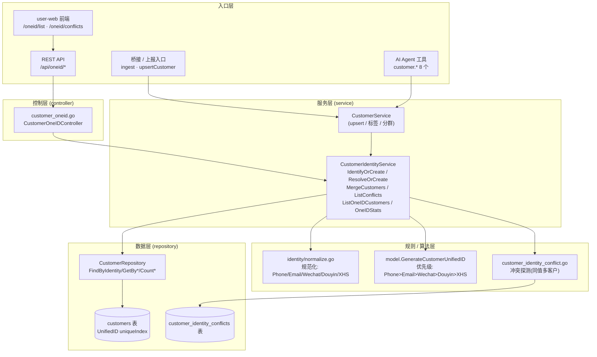
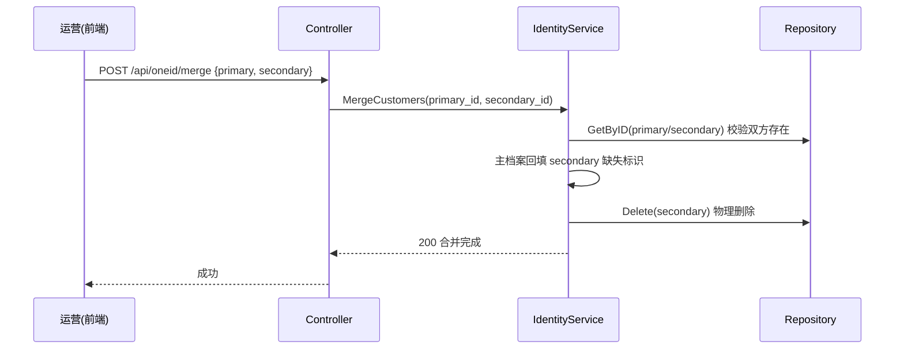

# OneID 客户身份归一体系 — 架构与功能文档

> 版本：v1.0 ｜ 整理日期：2026-08-13
> 范围：OneID（客户身份归一 / 冲突解决）从数据模型、服务层、API 到前端的完整流程、技术与功能清单。
> 配套文档：[oneid-analysis.md](./oneid-analysis.md)（反复论证与优化方案）。

---

## 1. 业务背景与目标

**OneID（统一客户身份）** 是私域 CDP 的核心能力：把散落在不同渠道、不同标识（手机号、邮箱、微信 OpenID、抖音 OpenID、小红书 ID）下的同一自然人在系统里归并为**唯一客户档案**，并用 `UnifiedID` 作为跨渠道、跨业务（会话、事件、标签、RFM、触达）的稳定主键。

核心价值：
- **去重**：同一用户在不同渠道多次建档时，自动合并到同一客户。
- **全景视图**：以 OneID 为中心聚合会话、事件、标签、RFM、流失风险。
- **精准触达**：避免同一自然人被多份档案重复营销。

---

## 2. 总体架构图



---

## 3. 数据模型

`customers` 表（见 `internal/model/customer.go`）：

| 字段 | 类型 | 说明 |
|------|------|------|
| `id` | varchar(36) PK | UUID，客户主键 |
| `unified_id` | varchar(64) **uniqueIndex** | OneID 稳定主键（核心） |
| `phone` | varchar(20) index | 手机号 |
| `email` | varchar(100) index | 邮箱 |
| `wechat_open_id` | varchar(64) index | 微信 OpenID |
| `douyin_open_id` | varchar(64) index | 抖音 OpenID |
| `xiaohongshu_id` | varchar(64) index | 小红书 ID |
| `tags` | text | JSON 标签数组 |
| `rfm_score` | int default 0 | RFM 分值 |
| `churn_risk` | varchar(20) default 'low' | 流失风险 low/medium/high |

### 3.1 UnifiedID 生成算法（确定性，幂等）
优先级链（取第一个非空）：
```
Phone  → "phone:" + 归一化手机号
Email  → "email:" + 归一化邮箱
Wechat → "wechat:" + openID
Douyin → "douyin:" + openID
XHS    → "xiaohongshu:" + xhsID
(全空) → uuid.New()   // 匿名/无标识客户
```
> 由 `Customer.BeforeCreate` 钩子保证：建档即定 ID，永不二次变更（合并时副档案被删，主档案 ID 保持不变）。

---

## 4. 核心流程

### 4.1 身份识别与合并（IdentifyOrCreate）— 最高频路径
入口：桥接 ingest、上报、AI 工具 `customer.search/upsert`。

```mermaid
flowchart TD
    A[入参: phone/email/wechat/douyin/xhs] --> B[逐项 normalize 规范化]
    B --> C{至少 1 个标识非空?}
    C -- 否 --> Z[返回 400 标识缺失]
    C -- 是 --> D[按优先级拼 UnifiedID]
    D --> E[FindByIdentity 全字段 OR 查询]
    E --> F{已存在匹配客户?}
    F -- 是 --> G[回填缺失标识(Update, 零值跳过)]
    F -- 否 --> H[Create 新建客户<br/>BeforeCreate 生成 UnifiedID]
    G --> I[返回 customer(+ is_new 标记)]
    H --> I
```

### 4.2 冲突探测（ListConflicts）
`customer_identity_conflict.go`：对同一 `identity_type + identity_value` 命中 **≥2 个不同客户** 即判定冲突，落 `customer_identity_conflicts` 表（状态 pending/resolved），并触发实时审计告警（`AUDIT-XXX`）。

### 4.3 冲突解决（MergeCustomers）


### 4.4 列表与统计
- `ListOneIDCustomers(page, limit, keyword)`：返回去重客户 + 总数（**注意：未消费 keyword**，详见分析文档）。
- `OneIDStats()`：`total / with_phone / with_email / with_wechat / with_douyin / multi_identity`。

---

## 5. API 端点清单

| 方法 | 路径 | 说明 | 调用方 |
|------|------|------|--------|
| GET | `/api/oneid/customers` | OneID 客户列表（分页/keyword） | 前端 List |
| GET | `/api/oneid/customers/:id` | 客户详情 | — |
| GET | `/api/oneid/stats` | OneID 统计 | 前端 List |
| GET | `/api/oneid/conflicts` | 冲突列表（pending） | 前端 Conflicts |
| POST | `/api/oneid/merge` | 合并（主/副客户） | 前端 Conflicts |
| POST | `/api/oneid/conflicts/:id/resolve` | 标记冲突已解决 | 前端 Conflicts |

> 路由注册于 `internal/router/service_routes.go`（user-server 8204）。

---

## 6. 前端功能清单

### 6.1 OneID 列表 (`views/oneid/List.vue`)
- 客户表格：UnifiedID、手机号、邮箱、微信、抖音、小红书、标签、RFM、流失风险、创建时间。
- 搜索框（姓名/手机号/邮箱，前端 `localSearch` 本地过滤）。
- 统计卡片：总客户、有手机号、有邮箱、多身份。
- 分页、行内复制、标签展示、风险徽标。
- **当前为前端桩数据**（`sampleCustomers` + 模拟分页），未真正联调后端列表/统计。

### 6.2 身份冲突解决 (`views/oneid/Conflicts.vue`)
- 冲突表格占位（冲突ID/主UnifiedID/副UnifiedID/冲突类型/状态/时间）：**纯静态桩，无数据请求、无解决交互**。
- 含「保留主档案 / 合并到主档案」按钮，但无后端调用。

### 6.3 API 封装 (`src/api/oneid.js`)
完整实现：`fetchOneIDCustomers / getOneIDCustomer / fetchOneIDStats / fetchConflicts / mergeCustomers / resolveConflict`，均经 `request` 实例发请求，baseURL 取 `VITE_API_BASE_URL`（三套 env 文件实测均为 `/`，即同源；dev 由 Vite 代理 `/api → http://localhost:8204`）。

### 6.4 路由与菜单
- 路由 `src/router/modules/oneid.js`：`/oneid/list`、`/oneid/conflicts`，挂在 Layout 父路由下。
- 菜单注册于 `router/index.js`（`'oneid'` 在白名单）。

---

## 7. 技术要点小结

| 维度 | 现状 |
|------|------|
| 标识类型 | 5 类（phone/email/wechat/douyin/xiaohongshu） |
| 合并策略 | "首次建档为权威 + 后续回填"，严格按优先级 |
| 冲突检测 | 写入 `customer_identity_conflicts` + 审计告警 |
| 一致性 | `UnifiedID` 永不重新生成；合并物理删除副档案 |
| 并发安全 | FindByIdentity 仅 OR 查询，无行锁/事务（高并发下有竞态） |

---

## 8. 待论证与优化

详见 [oneid-analysis.md](./oneid-analysis.md)，核心问题：
1. 列表 `keyword` 参数被忽略（搜索失效）。
2. 冲突解决前端为桩，未联调；字段约定与后端不一致。
3. 列表页前端仍用桩数据，未联调真实接口。
4. 合并为物理删除，未迁移会话/事件/标签归属（断链风险）。
5. 小红书 ID 未纳入 `IdentifyOrCreate` 优先级识别链。
6. 高并发下 IdentifyOrCreate 存在竞态（无事务/唯一约束兜底）。
