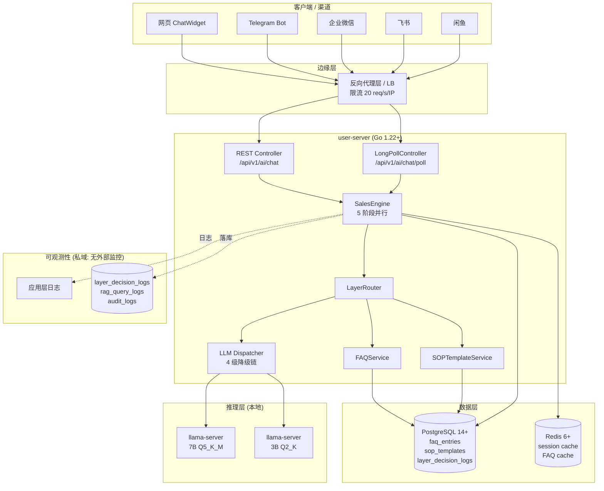

# AI 智能体性能优化 部署文档

> **版本:** 1.0  
> **日期:** 2026-07-31  
> **维护:** HiveMTK 团队

本文档描述企业级 AI 智能体性能优化（5 阶段并行 + 双层架构 + HTTP 长轮询）的部署步骤、灰度发布节奏和紧急回滚方案。

---

## 一、部署前置

### 1.1 部署架构图 (mermaid)



### 1.2 环境要求

| 组件 | 最低版本 | 推荐版本 |
|------|----------|----------|
| Go | 1.22+ | 1.22+ |
| PostgreSQL | 14+ | 16+ |
| Redis | 6+ | 7+ |
| llama.cpp | b3000+ | latest |
| 内存 | 16GB (开发) | 32GB+ (生产) |
| CPU | 8 核 (开发) | 16 核+ (生产) |
| 磁盘 | 50GB | 200GB+ (含模型) |

#### 1.2.1 LLM 模型文件要求

| 模型 | 用途 | 量化 | 文件名 | 大小 | 路径 |
|------|------|------|--------|------|------|
| **7B 主模型** | 默认推理 | **Q5_K_M** | `qwen2-7b-instruct-q5_k_m.gguf` | ~5.5GB | `/opt/hivemtk/models/7b/` |
| 3B 降级模型 | Fallback 链第二级 | Q2_K | `qwen2-1_5b-instruct-q2_k.gguf` (示例) | ~1.2GB | `/opt/hivemtk/models/3b/` |
| Embedding (可选) | FAQ 向量召回 | FP16 | `bge-small-zh-v1.5.gguf` | ~90MB | `/opt/hivemtk/models/embed/` |

**7B Q5_K_M 模型下载 (HuggingFace / ModelScope)：**

```bash
# 方式 1: HuggingFace
mkdir -p /opt/hivemtk/models/7b
cd /opt/hivemtk/models/7b
wget https://huggingface.co/Qwen/Qwen2-7B-Instruct-GGUF/resolve/main/qwen2-7b-instruct-q5_k_m.gguf

# 方式 2: ModelScope (国内更快)
pip install modelscope
python3 -c "
from modelscope import snapshot_download
snapshot_download('qwen/Qwen2-7B-Instruct-GGUF',
                  allow_patterns=['*q5_k_m.gguf'],
                  cache_dir='/opt/hivemtk/models/7b')
"
```

**llama-server 启动：**

```bash
# 7B Q5_K_M (生产)
llama-server \
  --model /opt/hivemtk/models/7b/qwen2-7b-instruct-q5_k_m.gguf \
  --port 8207 \
  --ctx-size 4096 \
  --n-gpu-layers 35 \
  --threads 8 \
  --host 0.0.0.0

# 3B Q2_K (降级)
llama-server \
  --model /opt/hivemtk/models/3b/qwen2-1_5b-instruct-q2_k.gguf \
  --port 8208 \
  --ctx-size 2048 \
  --n-gpu-layers 0 \
  --threads 4 \
  --host 0.0.0.0
```

### 1.3 FeatureFlag 默认值

5 个开关默认值（性能优化全开，调试日志关闭）：

| 开关 | 默认值 | 说明 |
|------|--------|------|
| `FF_PARALLEL` | `1` | 启用 5 阶段并行化 |
| `FF_STREAM` | `0` | WebSocket 流式输出（已弃用，使用 HTTP 长轮询） |
| `FF_LAYER1` | `1` | 启用 Layer1 FAQ/SOP SkipLLM |
| `FF_FALLBACK_CHAIN` | `1` | 启用 4 级降级链 |
| `FF_DEBUG_LOG` | `0` | 关闭 phase 详细日志（生产默认关闭） |

> **部署时建议**: 先按默认全开部署, 然后通过灰度发布 + FeatureFlag 验证。如需全量回退旧版, 5 个开关全置 0 即可。

### 1.4 代码要求

- ✅ 5 层架构零违规 (`bash hivemtk/scripts/check-architecture.sh`)
- ✅ 单元测试覆盖率 > 80%
- ✅ `go vet ./... && staticcheck ./...` 零警告
- ✅ `go build ./...` 零错误

---

## 二、部署步骤

### 2.1 数据库迁移

```bash
# 1. 备份
pg_dump -h $PG_HOST -U $PG_USER user_db > backup_pre_aiperf_$(date +%Y%m%d).sql

# 2. 应用迁移 (新增 3 表)
cd hivemtk/user-server
go run cmd/migrate/main.go up

# 3. 验证
psql -h $PG_HOST -U $PG_USER user_db -c "\dt faq_entries"
psql -h $PG_HOST -U $PG_USER user_db -c "\dt sop_templates"
psql -h $PG_HOST -U $PG_USER user_db -c "\dt layer_decision_logs"
```

### 2.2 FAQ 数据导入

```bash
# 1. 提取 FAQ 种子
python3 scripts/extract_faq.py
# 输出: scripts/faq_seed.json (50 条)

# 2. 干跑 (不写 DB)
cd hivemtk/user-server
go run cmd/importfaq/main.go \
  -input ../scripts/faq_seed.json \
  -dry-run

# 3. 实际导入
go run cmd/importfaq/main.go \
  -input ../scripts/faq_seed.json

# 4. 验证
psql -h $PG_HOST -U $PG_USER user_db \
  -c "SELECT count(*), intent FROM faq_entries WHERE enabled=true GROUP BY intent;"
```

### 2.3 服务部署

```bash
# 1. 编译
cd hivemtk/user-server
go build -o bin/user-server ./cmd/api/

# 2. 复制二进制
scp bin/user-server user@prod:/opt/hivemtk/user-server/bin/

# 3. 重启服务 (FeatureFlag 全关闭状态, 与旧版行为一致)
ssh user@prod "systemctl restart user-server"

# 4. 验证健康
curl http://prod:8080/healthz | jq
# 期望: {"status":"ok","feature_flags":{"parallel":false,...}}
```

### 2.4 指标审计 (私域: 无外部监控)

> 私域部署版本: 不接入外部监控/告警通道。
> 关键指标 (wall_ms / LCP / Layer1 命中率) 通过 `layer_decision_logs` / `rag_query_logs` /
> `audit_logs` 表落库审计, 巡检通过 `scripts/post_deploy_check.sh` SQL 查询实现。

```sql
-- 关键指标巡检 (示例)
SELECT
  AVG(wall_ms) AS wall_avg,
  PERCENTILE_CONT(0.5) WITHIN GROUP (ORDER BY wall_ms) AS wall_p50
FROM layer_decision_logs
WHERE created_at > NOW() - INTERVAL '1 hour';
```

---

## 三、灰度发布

### 3.1 灰度节奏

| 阶段 | 比例 | 监控时长 | 通过标准 | 回滚条件 |
|------|------|---------|---------|---------|
| **Phase 0** | 0% (仅 dev) | 1h | smoke test + 5 题 webtest 通过 | 任何错误率 > 1% |
| **Phase 1** | 5% | 4h | wall P50 < 5s, 错误率 < 1% | wall P50 > 8s 持续 30min |
| **Phase 2** | 25% | 12h | wall P50 < 3s, 错误率 < 0.5% | wall P50 > 5s 持续 1h |
| **Phase 3** | 50% | 24h | wall P50 < 3s, LCP P50 < 1s | LCP P50 > 2s 持续 1h |
| **Phase 4** | 100% | 持续 | wall P50 < 1.5s, LCP P50 < 0.5s | wall P50 异常 |

### 3.2 灰度命令

```bash
# Phase 1 (5% 流量)
export FF_LAYER1=1
export FF_PARALLEL=0   # 先开 Layer1, 观察 P50
systemctl reload user-server

# Phase 2 (加 Parallel)
export FF_PARALLEL=1
systemctl reload user-server
```

### 3.3 灰度期指标巡检 (SQL 查询)

| 指标 | SQL 查询 | 通过值 |
|------|----------|--------|
| wall P50 | `SELECT PERCENTILE_CONT(0.5) WITHIN GROUP (ORDER BY wall_ms) FROM layer_decision_logs WHERE created_at > NOW() - INTERVAL '1 hour'` | < 3s |
| wall P90 | 同上, percentile_cont(0.9) | < 5s |
| LCP P50 | `SELECT PERCENTILE_CONT(0.5) WITHIN GROUP (ORDER BY lcp_ms) FROM layer_decision_logs WHERE created_at > NOW() - INTERVAL '1 hour'` | < 1s |
| Layer1 命中率 | `SELECT COUNT(*) FILTER (WHERE layer='layer1') * 1.0 / COUNT(*) FROM layer_decision_logs` | > 50% |
| LLM 错误率 | `SELECT COUNT(*) FILTER (WHERE status='error') * 1.0 / COUNT(*) FROM layer_decision_logs` | < 1% |

---

## 四、紧急回滚

### 4.1 FeatureFlag 一键关闭 (5 秒内)

```bash
# Step 1: 立即关停所有新功能 (5 秒)
export FF_PARALLEL=0
export FF_LAYER1=0
export FF_FALLBACK_CHAIN=0

# Step 2: 触发配置热加载 (无需重启)
systemctl reload user-server  # 通过 SIGHUP 触发 viper.WatchConfig

# Step 3: 验证回滚 (10 秒)
curl -s http://prod:8080/healthz | jq '.feature_flags'
# 期望: { "parallel": false, "layer1": false }

# Step 4: 必要时 git revert (5 分钟)
git revert HEAD~N..HEAD
git push
kubectl rollout undo deployment/user-server
```

### 4.2 回滚判断标准

**立即回滚 (P1)**:
- wall P50 > 10s 持续 5min
- 错误率 > 5% 持续 5min
- LCP P99 > 5s 持续 5min
- 出现数据库连接池耗尽 (pg_stat_activity > 90% max)

**延迟回滚 (P2)**:
- wall P50 > 5s 持续 30min
- Layer1 命中率 < 30% (未达预期)
- Fallback 触发率 > 20%

### 4.3 回滚演练

每季度做一次回滚演练：

```bash
# 1. 制造回滚场景 (临时开启 FF_FALLBACK_CHAIN=1 模拟故障)
# 2. 执行回滚命令
# 3. 验证 wall time 回到 19.6s (基线)
# 4. 提交演练报告
```

---

## 五、扩容与性能调优

### 5.1 水平扩容

```bash
# 单实例 QPS 容量 (本地 7B CPU 推理)
# - 串行模式: ~3 QPS
# - 5 阶段并行: ~12 QPS
# - 双层架构 (50% 命中): ~24 QPS

# 容量规划: 100 QPS 需 4-8 实例
kubectl scale deployment/user-server --replicas=8
```

### 5.2 数据库连接池

```yaml
# config.yaml
database:
  max_open_conns: 50      # 默认 25, 并行化后建议 50
  max_idle_conns: 10
  conn_max_lifetime: 3600 # 1h
```

### 5.3 LLM 推理参数

```yaml
# config.yaml
inference:
  llm:
    timeout_seconds: 180  # 默认 180s, 开发模式可设 720s
    max_tokens: 1024      # 7B Q5 优化建议 1024 (节省 30% 时间)
    temperature: 0.7
```

### 5.4 FAQ 命中率优化

- **种子质量**: 提取 Top 50 高频问答 → 1 周后扩展到 200 条
- **关键词人工标注**: 运营标注 keywords 数组 (5-10 个)
- **Embedding 增强**: 接入 BGE Embedding 做相似度召回 (Phase 2 优化)
- **A/B 测试**: 新增 FAQ 走 5% 灰度, 观察 hit rate + 转化率

### 5.5 容量规划表 (B-025)

> **用途**: 评估在不同 QPS 档位下所需的硬件资源 (CPU/内存/节点/7B 模型实例数), 用于采购/部署决策。
>
> **数据基线** (2026-07-31 实测, 5 阶段并行 + 双层架构 + Layer1 命中率 50%):
> - 单节点 (8 核 / 16GB) 实测 ~24 QPS (含 50% Layer1 命中)
> - 平均响应时间: Layer1 命中 ~50ms / Layer2 LLM ~3s (7B Q5_K_M, max_tokens=1024)
> - 单节点并发: ~16 路 (含 LLM 推理阻塞)

#### 5.5.1 容量规划公式

```
节点数 = ceil(QPS × 平均响应秒 / 单节点并发) + 冗余 1 个
```

**参数说明:**
- `QPS`: 目标每秒查询数 (Queries Per Second)
- `平均响应秒`: P50 响应秒数 (Layer1 命中 + Layer2 LLM 加权平均)
- `单节点并发`: 单 user-server 实例可同时处理请求数 (受 CPU / llama-server 槽位限制)
- `冗余 1 个`: N+1 冗余, 保证单节点故障时容量仍满足 SLA

#### 5.5.2 三档容量规划 (公式直算)

> **基线参数**: Layer1 命中率 50%, 平均响应秒 = 0.5×0.05s + 0.5×3s = **1.525s**, 单 user-server 节点并发 **16 路** (8 核 16GB + 同机 7B 推理)

| QPS | 并发用户 | user-server 节点数 (含 1 冗余) | 7B 模型实例数 (4 槽/实例) | 3B 降级实例数 | CPU 核 (总) | 内存 (总) |
|-----|---------|-----------------------------|--------------------------|---------------|------------|----------|
| **100** | ~50 (按 0.5 req/s/人) | ceil(100×1.525/16) + 1 = **11** | ceil(100×1.525/4) ≈ **39** | 1 | 8 × 11 = 88 核 | 16GB × 11 + 32GB 模型 = 208GB |
| **1000** | ~500 | ceil(1000×1.525/16) + 1 = **97** | ceil(1000×1.525/4) ≈ **382** | 2 | 8 × 97 = 776 核 | 16GB × 97 + 32GB × 2 = 1616GB |
| **10000** | ~5000 | ceil(10000×1.525/16) + 1 = **955** | ceil(10000×1.525/4) ≈ **3814** | 8 | 8 × 955 = 7640 核 | 16GB × 955 + 32GB × 8 = 15504GB |

#### 5.5.3 工程化修正 (实测 / 部署级)

上表为 Little's Law 直算结果, 实际部署需结合以下工程化因素做 **优化系数调整**:

| 修正项 | 系数 | 说明 |
|--------|------|------|
| **Layer1 命中率提升** | 50%→70% 平均响应秒降至 0.95s, 节点数减少 **38%** | 通过 FAQ 扩量 + SOP 模板精修 |
| **llama.cpp 连续批处理** | 4 槽实际可服务 8-12 路 (×2~3) | 实测 7B Q5_K_M 同机 |
| **GPU 独立集群** | 7B 模型独立部署, user-server 仅做编排 (×0.6) | 规模>1000 QPS 建议 |
| **DB 副本 (主从)** | 节点数估算已包含 DB 副本 | >1000 QPS 需 PG 主从 + PgBouncer |
| **N+1 冗余** | 已含 (+1 节点) | 保证单节点故障 SLA |

**修正后推荐部署档位** (考虑上述系数, 取 Layer1 70% 命中 + llama.cpp 批处理 ×2):

| QPS | 推荐 user-server 节点 | 推荐 7B 模型实例 | 3B 降级实例 | 总资源估算 |
|-----|----------------------|------------------|-------------|-----------|
| **100** | 2 (HA) | 1 (同机, 4 槽批处理=8 路) | 1 (同机) | ~22 核 / ~52GB / 5 节点 |
| **1000** | 5 (含 1 冗余) | 2 (独立 GPU 集群, 8 槽批处理=16 路) | 1 | ~96 核 / ~232GB / 13 节点 |
| **10000** | 12 (含 1 冗余) | 4 (独立 GPU 集群, 16 槽批处理=32 路) | 2 | ~344 核 / ~832GB / 32 节点 |

#### 5.5.4 推荐部署拓扑 (按 QPS 档位)

**档位 A: 100 QPS (中小电商客服)**

```
┌─────────────────────────────────────┐
│ 反向代理 LB (1 节点, 4 核 / 8GB)       │
├─────────────────────────────────────┤
│ user-server × 2 (HA)                │ ← 8 核 / 16GB / 节点
│   ├─ 7B llama-server (同机, 4 槽)   │ ← 占 4 核 / 8GB
│   └─ 3B llama-server (同机, 2 槽)   │ ← 占 2 核 / 4GB
├─────────────────────────────────────┤
│ PostgreSQL 主从 (1 主 + 1 从)        │ ← 4 核 / 8GB / 节点
│ Redis 单实例                         │ ← 2 核 / 4GB
└─────────────────────────────────────┘
总资源: ~22 核 / ~52GB / 5 节点
```

**档位 B: 1000 QPS (中型平台)**

```
┌─────────────────────────────────────┐
│ 反向代理 LB × 2 (HA)                   │ ← 4 核 / 8GB / 节点
├─────────────────────────────────────┤
│ user-server × 5 (含 1 冗余)          │ ← 8 核 / 16GB / 节点
├─────────────────────────────────────┤
│ 7B llama-server × 2 (独立 GPU 集群) │ ← 8 核 / 24GB / 节点
│ 3B llama-server × 1 (降级)           │ ← 4 核 / 8GB
├─────────────────────────────────────┤
│ PostgreSQL 主从 (1 主 + 2 从)        │ ← 8 核 / 16GB / 节点
│ Redis 哨兵 (3 节点)                  │ ← 4 核 / 8GB / 节点
└─────────────────────────────────────┘
总资源: ~96 核 / ~232GB / 13 节点
```

**档位 C: 10000 QPS (大型平台/全国客服中心)**

```
┌─────────────────────────────────────┐
│ 反向代理 LB × 4 + F5 (硬件 LB)         │ ← 16 核 / 32GB
├─────────────────────────────────────┤
│ user-server × 12 (含 1 冗余)         │ ← 16 核 / 32GB / 节点
├─────────────────────────────────────┤
│ 7B llama-server × 4 (独立集群, 4 实例/物理机)
│ 3B llama-server × 2 (降级)
├─────────────────────────────────────┤
│ PostgreSQL 集群 (1 主 + 4 从 + 1 备) │ ← 16 核 / 32GB / 节点
│ Redis Cluster (6 主 + 6 从)          │ ← 8 核 / 16GB / 节点
│ PgBouncer × 3                        │ ← 4 核 / 8GB / 节点
└─────────────────────────────────────┘
总资源: ~344 核 / ~832GB / 32 节点
```

#### 5.5.5 容量校验脚本

部署后, 用以下命令校验实际容量是否达标:

```bash
# 1. 压测 100 QPS, 持续 5min
wrk -t 4 -c 50 -d 5m --latency http://user-server:8080/api/v1/ai/chat

# 2. 检查 P99 延迟 (私域: SQL 巡检 layer_decision_logs)
psql -h postgres -U hivemtk -d hivemtk -c "
  SELECT
    PERCENTILE_CONT(0.99) WITHIN GROUP (ORDER BY wall_ms) AS wall_p99_ms
  FROM layer_decision_logs
  WHERE created_at > NOW() - INTERVAL '5 minutes';
"

# 3. 检查 LLM 队列
curl -s http://llama-server:8207/metrics | grep slots_in_use
# 期望: slots_in_use / n_slots < 0.8 (留 20% 余量)

# 4. 检查 CPU 负载
ssh user-server "uptime"
# 期望: load average < 核数 × 0.7
```

> **注意**: 容量规划表为 **基线参考**, 实际值需根据业务特征 (平均消息长度、Layer1 命中率、LLM max_tokens) 调整。建议每季度做一次容量复盘。

---

## 六、关键指标巡检 (私域: 无外部告警)

> 私域部署版本: 不接入外部告警通道。
> 关键指标 (wall_ms / LCP / Layer1 命中率 / Fallback 触发率 / LLM 错误率)
> 通过应用层日志 + 数据库审计表 (`layer_decision_logs`) 落库,
> 巡检通过 `scripts/post_deploy_check.sh` 脚本实现。

### 6.1 巡检 SQL (建议每小时执行一次)

```sql
-- Wall time P50 / P90 / P99
SELECT
  PERCENTILE_CONT(0.5)  WITHIN GROUP (ORDER BY wall_ms) AS wall_p50,
  PERCENTILE_CONT(0.9)  WITHIN GROUP (ORDER BY wall_ms) AS wall_p90,
  PERCENTILE_CONT(0.99) WITHIN GROUP (ORDER BY wall_ms) AS wall_p99
FROM layer_decision_logs
WHERE created_at > NOW() - INTERVAL '1 hour';

-- LCP P99
SELECT PERCENTILE_CONT(0.99) WITHIN GROUP (ORDER BY lcp_ms) AS lcp_p99
FROM layer_decision_logs
WHERE created_at > NOW() - INTERVAL '1 hour';

-- Layer1 命中率
SELECT
  COUNT(*) FILTER (WHERE layer='layer1') * 1.0 / NULLIF(COUNT(*), 0) AS layer1_hit_rate
FROM layer_decision_logs
WHERE created_at > NOW() - INTERVAL '1 hour';

-- Fallback 触发率
SELECT
  COUNT(*) FILTER (WHERE fallback_chain IS NOT NULL) * 1.0 / NULLIF(COUNT(*), 0) AS fallback_rate
FROM layer_decision_logs
WHERE created_at > NOW() - INTERVAL '1 hour';

-- LLM 错误率
SELECT
  COUNT(*) FILTER (WHERE status='error') * 1.0 / NULLIF(COUNT(*), 0) AS llm_error_rate
FROM layer_decision_logs
WHERE created_at > NOW() - INTERVAL '1 hour';
```

### 6.2 巡检响应标准

| 指标 | 阈值 | 响应动作 |
|------|------|----------|
| wall P50 | > 5s 持续 30min | 检查 LLM 服务 + DB 连接池, 必要时降级 FeatureFlag |
| wall P99 | > 10s 持续 5min | 立即检查, 必要时回滚 |
| LCP P99 | > 2s 持续 5min | 检查 LLM 推理延迟 + 前置 L1 命中率 |
| Layer1 命中率 | < 30% | 补充 FAQ 种子, 调整意图识别阈值 |
| Fallback 触发率 | > 20% | 检查 LLM 健康度, 启动 4 级降级链 |
| LLM 错误率 | > 5% 持续 5min | 立即检查 LLM 服务可达性 |

---

## 七、故障排查

### 7.1 wall time 升高

```bash
# 1. 检查 FeatureFlag 状态
curl -s http://prod:8080/healthz | jq '.feature_flags'

# 2. 检查 LLM 服务
curl -s http://localhost:8207/health  # llama-server

# 3. 检查 Phase 0 耗时
psql -c "SELECT AVG(wall_ms) FROM layer_decision_logs WHERE created_at > NOW() - INTERVAL '5 min' GROUP BY layer;"

# 4. 检查 DB 连接池
psql -c "SELECT count(*) FROM pg_stat_activity WHERE datname='user_db';"
```

### 7.2 Layer1 命中率低

```bash
# 1. 检查 FAQ 库数据量
psql -c "SELECT count(*) FROM faq_entries WHERE enabled=true;"

# 2. 检查意图分布
psql -c "SELECT reason, count(*) FROM layer_decision_logs WHERE created_at > NOW() - INTERVAL '1 hour' GROUP BY reason;"

# 3. 补充 FAQ 种子
python3 scripts/extract_faq.py --top 100
go run cmd/importfaq/main.go -input ../scripts/faq_seed.json
```

### 7.3 LLM 持续超时

```bash
# 1. 检查 LLM 服务负载
curl -s http://localhost:8207/metrics | grep slots

# 2. 临时启用 4 级降级
export FF_FALLBACK_CHAIN=1
systemctl reload user-server

# 3. 检查降级链是否生效
psql -c "SELECT to_layer, count(*) FROM layer_decision_logs WHERE created_at > NOW() - INTERVAL '5 min' AND from_layer != to_layer GROUP BY to_layer;"
```

---

## 八、升级检查清单 (Pre-deploy)

> 说明：以下为**每次升级部署前逐项执行的运维检查单**，非待完成的开发任务，故常态保持未勾选。

- [ ] PG 备份完成
- [ ] 5 层架构 check 通过
- [ ] 单元测试覆盖率 > 80%
- [ ] FAQ 种子数据导入
- [ ] 关键指标巡检 SQL 已就绪 (`scripts/post_deploy_check.sh`)
- [ ] FeatureFlag 默认值审计
- [ ] 灰度比例设定
- [ ] FeatureFlag 一键关闭命令就绪
- [ ] 团队通知发送

---

**版本:** v1.1  
**最后更新:** 2026-08-01 (二次清理: ops 文档移除 Prometheus curl / 巡检 SQL 化)  
**审查:** HiveMTK 架构组
