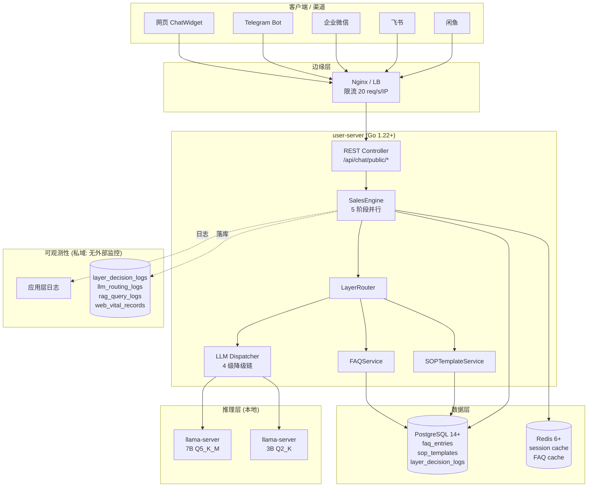

# AI 智能体性能优化 部署文档

> **版本:** 1.0  
> **日期:** 2026-07-31  
> **维护:** HiveMTK 团队

本文档描述企业级 AI 智能体性能优化（5 阶段并行 + 双层架构）的部署步骤、灰度发布节奏和紧急回滚方案。

> 旧版本在本句里还写着"HTTP 长轮询"：仓库里**没有**长轮询实现
> （`grep -rn "LongPoll\|long_poll\|/poll" user-server/internal/router/ user-server/internal/controller/`
> 零命中），那枚桥接旗子（旗子名 `sse_bridge`、环境变量 `FF_SSE_BRIDGE`、Go 常量
> `FF_ENABLE_SSE_BRIDGE`）也**不切换传输**，它只被
> `internal/controller/bridge_capabilities.go:45` 读出来写进 capabilities 的 `sse_enabled` 字段。
> 出站真实链路是 SSE（见 `Bridge_Runbook.md`）。

> **2026-10-09 按代码复核并订正**，口径与姊妹篇
> [`AI_AGENT_PERF_API.md`](AI_AGENT_PERF_API.md) 文首的 2026-09-22 实测勘误表一致：
> FeatureFlag 是 **6 个**且 5 个默认 `false`（见 §1.3）；**没有配置热加载**，改 `FF_*` 必须重启进程
> （见 §3.2）；迁移**没有 CLI 入口**，是服务启动期跑的（见 §2.1）；
> `layer_decision_logs` 里**没有** `lcp_ms` / `status` / `fallback_chain` / `from_layer` / `to_layer`
> 这些列（见 §3.3、§6.1、§7.3）；user-server 监听 **8204**，且 `/healthz` 不回 `feature_flags`。

---

## 一、部署前置

### 1.1 部署架构图 (mermaid)


```mermaid
graph TB
    subgraph Client["客户端 / 渠道"]
        W[网页 ChatWidget]
        TG[Telegram Bot]
        WC[企业微信]
        FS[飞书]
        XY[闲鱼]
    end

    subgraph Edge["边缘层"]
        NGX[Nginx / LB<br/>限流 20 req/s/IP]
    end

    subgraph App["user-server (Go 1.22+)"]
        REST[REST Controller<br/>/api/chat/public/*]
        SE[SalesEngine<br/>5 阶段并行]
        LR[LayerRouter]
        FAQ[FAQService]
        SOP[SOPTemplateService]
        DISP[LLM Dispatcher<br/>4 级降级链]
    end

    subgraph Inference["推理层 (本地)"]
        L7B[llama-server<br/>7B Q5_K_M]
        L3B[llama-server<br/>3B Q2_K]
    end

    subgraph Data["数据层"]
        PG[(PostgreSQL 14+<br/>faq_entries<br/>sop_templates<br/>layer_decision_logs)]
        REDIS[(Redis 6+<br/>session cache<br/>FAQ cache)]
    end

    subgraph Obs["可观测性 (私域: 无外部监控)"]
        LOG[应用层日志]
        AUDIT[(layer_decision_logs<br/>llm_routing_logs<br/>rag_query_logs<br/>web_vital_records)]
    end

    W & TG & WC & FS & XY --> NGX
    NGX --> REST
    REST --> SE
    SE --> LR
    LR --> FAQ
    LR --> SOP
    LR --> DISP
    FAQ --> PG
    SOP --> PG
    SE --> PG
    SE --> REDIS
    DISP --> L7B
    DISP --> L3B
    SE -.日志.-> LOG
    SE -.落库.-> AUDIT
```

### 1.2 环境要求

| 组件 | 最低版本 | 推荐版本 |
|------|----------|----------|
| Go | 1.22+ | 1.22+ |
| PostgreSQL | 14+ | 16+ |
| Redis | 6+ | 7+ |
| llama.cpp | b3000+ | latest |
| 内存 | 16GB (开发) | 32GB+ (生产) |
| CPU | 8 核 (开发) | 16 核+ (生产) |
| 磁盘 | 50GB | 200GB+ (含模型) |

#### 1.2.1 LLM 模型文件要求

| 模型 | 用途 | 量化 | 文件名 | 大小 | 路径 |
|------|------|------|--------|------|------|
| **7B 主模型** | 默认推理 | **Q5_K_M** | `qwen2-7b-instruct-q5_k_m.gguf` | ~5.5GB | `/opt/hivemtk/models/7b/` |
| 3B 降级模型 | Fallback 链第二级 | Q2_K | `qwen2-1_5b-instruct-q2_k.gguf` (示例) | ~1.2GB | `/opt/hivemtk/models/3b/` |
| Embedding (可选) | FAQ 向量召回 | FP16 | `bge-small-zh-v1.5.gguf` | ~90MB | `/opt/hivemtk/models/embed/` |

**7B Q5_K_M 模型下载 (HuggingFace / ModelScope)：**

```bash
# 方式 1: HuggingFace
mkdir -p /opt/hivemtk/models/7b
cd /opt/hivemtk/models/7b
wget https://huggingface.co/Qwen/Qwen2-7B-Instruct-GGUF/resolve/main/qwen2-7b-instruct-q5_k_m.gguf

# 方式 2: ModelScope (国内更快)
pip install modelscope
python3 -c "
from modelscope import snapshot_download
snapshot_download('qwen/Qwen2-7B-Instruct-GGUF',
                  allow_patterns=['*q5_k_m.gguf'],
                  cache_dir='/opt/hivemtk/models/7b')
"
```

**llama-server 启动：**

```bash
# 7B Q5_K_M (生产)
llama-server \
  --model /opt/hivemtk/models/7b/qwen2-7b-instruct-q5_k_m.gguf \
  --port 8207 \
  --ctx-size 4096 \
  --n-gpu-layers 35 \
  --threads 8 \
  --host 0.0.0.0

# 3B Q2_K (降级)
llama-server \
  --model /opt/hivemtk/models/3b/qwen2-1_5b-instruct-q2_k.gguf \
  --port 8208 \
  --ctx-size 2048 \
  --n-gpu-layers 0 \
  --threads 4 \
  --host 0.0.0.0
```

### 1.3 FeatureFlag 默认值

代码注册的开关共 **6 个**，默认值取 `internal/pkg/featureflag/flag.go:64-69`（现读）：

| 开关（env 名） | 默认值 | 说明 |
|------|--------|------|
| `FF_PARALLEL` / `parallel` | `false` | 启用 5 阶段并行化 |
| `FF_STREAM` / `stream` | `false` | 流式输出开关。注意 WebSocket **并未弃用**：`/api/ws/visitor`、`/api/ws/channel`、`/api/ws/agent`、`/api/browser/host-ws` 四路仍在注册（`docs/PORT_REGISTRY.md` 长连接清单） |
| `FF_LAYER1` / `layer1` | `false` | 启用 Layer1 FAQ/SOP SkipLLM |
| `FF_FALLBACK_CHAIN` / `fallback_chain` | `false` | 启用 4 级降级链 |
| `FF_DEBUG_LOG` / `debug_log` | `false` | phase 详细日志 |
| `FF_SSE_BRIDGE` / `sse_bridge` | `true` | 桥接 SSE（6 个里唯一默认开的）；env 名由 `EnvNameOf`（`flag.go:166-179`）从旗子名 `sse_bridge` 拼出，代码里的常量 `FF_ENABLE_SSE_BRIDGE`（`flag.go:28`）**是 Go 常量名，不是环境变量名**，导出它不会生效 |

> 默认值全为 `false` 意味着**装好即回旧行为**，灰度靠逐个置 1，不靠"默认全开再回退"。
> 消费点现测（`grep -rn 'featureflag\.\(Get\|Flag\)("…"' internal/ cmd/`，排除 `_test`）：
> `debug_log` 4 处、`layer1` 4 处（都在 `service/layer.go`）、`parallel` 2 处（`Get` + `Flag`）、
> `sse_bridge` 1 处（`controller/bridge_capabilities.go:45`，只发布 `sse_enabled` 能力位，不切换传输）；
> **`stream` 零读取点**（注册了但全仓无人 `Get`），`fallback_chain` 唯一的读取点在
> `aiagent/llm/fallback_tree.go:106`，而该文件的 `NewDecisionTree`/`ExecuteWithFallback` 在非测试代码里
> 没有任何调用方 ⇒ 这一路目前**不可达**。这两枚按哑开关对待，别把它们写进灰度剧本。

> **部署时建议**: 先按默认（全 `false`）部署确认与旧版行为一致，再通过灰度发布逐个开。如需全量回退旧版，把已开的置 0 并重启进程（见 §3.2 的生效方式）。

### 1.4 代码要求

- ✅ 5 层架构零违规 (`bash hivemtk/scripts/check-architecture.sh`)
- ✅ 单元测试覆盖率 > 80%
- ✅ `go vet ./... && staticcheck ./...` 零警告
- ✅ `go build ./...` 零错误

---

## 二、部署步骤

### 2.1 数据库迁移

> **先设连接参数**（本文所有 `psql` / `pg_dump` 都用这一组，在**仓库根**执行）：
> `.env` 里**没有** `PG_HOST` / `PG_USER` 这两个变量（旧版本本文直接用它们，展开成空串后
> psql 会回落到"本机 socket + 当前 OS 用户"，在容器化数据层上必然连不上）。
> 真实键名是 `DB_HOST` / `DB_PORT` / `POSTGRES_USER` / `POSTGRES_PASSWORD` / `USER_DB_NAME`
> （默认值依次为 `127.0.0.1` / `8202` / `admin` / .env 里的口令 / `user_db`；
> 宿主机映射口可被 `USER_POSTGRES_HOST_PORT` 改到 8232，见 `docker-compose.yml:83-84` 与 `docs/PORT_REGISTRY.md`）。
>
> ```bash
> set -a; . ./.env; set +a          # 只能在仓库根执行（见下一条）
> export PGHOST="$DB_HOST" PGPORT="$DB_PORT" PGUSER="$POSTGRES_USER" PGDATABASE="$USER_DB_NAME"
> # 口令走 PGPASSWORD（或 ~/.pgpass），不要把值写进命令行、日志或本文档
> export PGPASSWORD="$POSTGRES_PASSWORD"
> psql -c "SELECT current_database(), inet_server_port();"   # 正控制：读到 user_db/8202 才算参数进去了
> ```
>
> **为什么强调"仓库根"**：`user-server/.env` 里也有一个 `POSTGRES_PASSWORD` 键，而且**两份值不同**
> （现测 `hivemtk/.env` 与 `hivemtk/user-server/.env` 各 48 字符、逐字节不等）。
> 在 `user-server/` 目录下执行 `. ./.env` 不是报错，而是**静默读到另一份口令**，
> 症状是 `FATAL: password authentication failed for user "admin"`（现测复现过一次）。
> 容器与 `make dev` 都以根目录那份为准，所以本文的连接口令一律从 `hivemtk/.env` 取。
> 键名比对只认键是否存在（两边都有 `POSTGRES_PASSWORD`），值不落在任何文档或日志里。

```bash
# 1. 备份（PG* 环境变量已由上面导出，-h/-U 无需再写）
pg_dump user_db > backup_pre_aiperf_$(date +%Y%m%d).sql

# 2. 应用迁移 (新增 3 表)
# 没有 `cmd/migrate` 这个 CLI 入口（`user-server/cmd/` 下不存在 migrate 目录）。
# 建表走**启动期 GORM AutoMigrate**：`internal/pkg/db/migrate.go:20 allModels()` 里
# 已登记 `FAQEntry`(:234) / `SOPTemplate`(:235) / `LayerDecisionLog`(:236)，
# 实际执行集合是 `allModels() + ExtraModels()`（同文件 :444）。
# 注意别和 `migration_records` 那套混起来：那是版本升级任务
# （`internal/migration/service.go:47 ExecuteUpgrade`，HTTP 触发口 `internal/controller/migration.go:120`），
# 且它的 from/to 两个参数并不参与选单，只对 `migration_records` 做集合减法 —— 全新库会把已注册迁移全跑一遍。
# ⇒ 正确动作是"带着新二进制重启 user-server"，然后按下述 \dt 验证三表出现。
cd hivemtk/user-server

# 3. 验证（回到仓库根执行，或沿用上面的 PG* 环境变量）
psql -d user_db -c "\dt faq_entries"
psql -d user_db -c "\dt sop_templates"
psql -d user_db -c "\dt layer_decision_logs"
```

### 2.2 FAQ 数据导入

```bash
# 1. 提取 FAQ 种子
# extract_faq.py 的 --input 默认值是作者本机的绝对路径（仓库外、且已不存在），
# 不带 --input 必然报文件不存在 —— 见 §7.2 第 3 步的同条说明。
python3 scripts/extract_faq.py --input <你的清洗后语料.jsonl>
# 输出: scripts/faq_seed.json（--top 默认 50 条）

# 2. 干跑 (不写 DB)
cd hivemtk/user-server
go run cmd/importfaq/main.go \
  -input ../scripts/faq_seed.json \
  -dry-run

# 3. 实际导入
go run cmd/importfaq/main.go \
  -input ../scripts/faq_seed.json

# 4. 验证
psql -d user_db \
  -c "SELECT count(*), intent FROM faq_entries WHERE enabled=true GROUP BY intent;"
```

### 2.3 服务部署

```bash
# 1. 编译
cd hivemtk/user-server
go build -o bin/user-server ./cmd/api/

# 2. 复制二进制（user@prod 是占位主机名，换成实际部署机；本仓不提供 ssh 别名）
scp bin/user-server user@prod:/opt/hivemtk/user-server/bin/

# 3. 重启服务 (FeatureFlag 全关闭状态, 与旧版行为一致)
ssh user@prod "systemctl restart user-server"

# 4. 验证健康
curl http://prod:8204/healthz | jq
# 期望（2026-10-09 于开发实例实测，74 字节）：
#   {"code":0,"message":"ok","data":{"status":"alive","timestamp":<unix>}}
# —— 业务体在 data 里，外层是统一信封（response.Success），不是裸 {"status":...}。
# 注意: /healthz 是存活探针（`internal/router/health.go:135-142` 的 LivenessCheck），
# **不回 feature_flags**，也不接依赖；要看依赖用 /health，要看就绪用 /readyz（`internal/router/router.go:202-204`）。
# 确认开关实际生效值没有 HTTP 面可读，只能看进程 env 与行为（或 `ENABLE_DEBUG_ROUTES=true` 时的 /__debug__/routes）。
```

### 2.4 指标审计 (私域: 无外部监控)

> 私域部署版本: 不接入外部监控/告警通道。
> 关键指标 (wall_ms / LCP / Layer1 命中率) 落库位置：
> `layer_decision_logs`（决策与 wall_ms）、`llm_routing_logs`（LLM 调用延迟与成败）、
> `rag_query_logs`（检索延迟与命中）、`web_vital_records`（LCP 等前端指标）。
> **没有** `audit_logs` 这张表（旧版本在这里列了它）。审计族真实表名以
> `grep -rhn 'TableName() string { return "' user-server/internal/model/ | grep audit` 现取为准：
> `tool_call_audits` / `feature_flag_audit_logs` / `config_param_audit_logs` /
> `security_audits` / `security_audit_items` / `kb_change_audit_logs` —— 都不承载本节指标。
> （顺带一条会误导人的注释：`internal/app/agent_deep_audit_test.go:101` 写作
> `agent_tool_audit_logs`，该表名在仓库里不存在，工具调用的真实落库表是 `tool_call_audits`。）
> 巡检**没有**现成脚本：§6.1 的 SQL 手工执行。
> `scripts/post_deploy_check.sh` 是**知识库分组 G0–G4 的部署后验收脚本**
> （见其文件头与 `KNOWLEDGE_GROUP_DEPLOY.md`），查的是 `/health`、`knowledge_bases` 表与索引、
> 登录与 KB 建删，**不含**本节的任何 AI 性能指标 —— 旧版本把它当成本特性的巡检入口，属误引。

```sql
-- 关键指标巡检 (示例)
SELECT
  AVG(wall_ms) AS wall_avg,
  PERCENTILE_CONT(0.5) WITHIN GROUP (ORDER BY wall_ms) AS wall_p50
FROM layer_decision_logs
WHERE created_at > NOW() - INTERVAL '1 hour';
```

---

## 三、灰度发布

### 3.1 灰度节奏

| 阶段 | 比例 | 监控时长 | 通过标准 | 回滚条件 |
|------|------|---------|---------|---------|
| **Phase 0** | 0% (仅 dev) | 1h | smoke test + 5 题 webtest 通过 | 任何错误率 > 1% |
| **Phase 1** | 5% | 4h | wall P50 < 5s, 错误率 < 1% | wall P50 > 8s 持续 30min |
| **Phase 2** | 25% | 12h | wall P50 < 3s, 错误率 < 0.5% | wall P50 > 5s 持续 1h |
| **Phase 3** | 50% | 24h | wall P50 < 3s, LCP P50 < 1s | LCP P50 > 2s 持续 1h |
| **Phase 4** | 100% | 持续 | wall P50 < 1.5s, LCP P50 < 0.5s | wall P50 异常 |

### 3.2 灰度命令

> 与 §4.1 同一条约束：`FF_*` 只在进程启动时被读进内存（`internal/pkg/featureflag/flag.go`
> 的轮询器读的是 `os.LookupEnv`，即**当前进程**的环境，不是磁盘上的 `.env`），
> 所以**没有 reload 这一说**，改完必须 `systemctl restart`；
> 而在交互 shell 里 `export` 只影响这条命令行自己的进程，动不了已在跑的 user-server ——
> systemd 部署下要改的是 unit 的 `Environment=`（或它引用的 `EnvironmentFile`）。

```bash
# Phase 1 (5% 流量)：先开 Layer1, 观察 P50
sudo systemctl edit user-server   # 在 [Service] 段写 Environment="FF_LAYER1=1" "FF_PARALLEL=0"
sudo systemctl daemon-reload
sudo systemctl restart user-server

# Phase 2 (加 Parallel)
sudo systemctl edit user-server   # Environment="FF_PARALLEL=1"
sudo systemctl daemon-reload
sudo systemctl restart user-server

# 改完先自证开关真的到了进程环境里（systemd 的进程环境只能从 /proc 读）
sudo tr '\0' '\n' < /proc/$(pgrep -f user-server | head -1)/environ | grep '^FF_'
```

### 3.3 灰度期指标巡检 (SQL 查询)

| 指标 | SQL 查询 | 通过值 |
|------|----------|--------|
| wall P50 | `SELECT PERCENTILE_CONT(0.5) WITHIN GROUP (ORDER BY wall_ms) FROM layer_decision_logs WHERE created_at > NOW() - INTERVAL '1 hour'` | < 3s |
| wall P90 | 同上, percentile_cont(0.9) | < 5s |
| Layer1 命中率 | `SELECT COUNT(*) FILTER (WHERE layer='layer1') * 1.0 / NULLIF(COUNT(*), 0) FROM layer_decision_logs` | > 50% |
| LLM 跳过率 | `SELECT COUNT(*) FILTER (WHERE llm_skipped) * 1.0 / NULLIF(COUNT(*), 0) FROM layer_decision_logs` | 与 Layer1 命中率同向 |
| 降级链触发率 | `SELECT COUNT(*) FILTER (WHERE reason='fallback') * 1.0 / NULLIF(COUNT(*), 0) FROM layer_decision_logs` | 观察项 |

> 本表列名以 `internal/model/layer_decision_log.go:30-45` 现读为准：只有
> `trace_id / session_id / customer_id / layer / reason / intent / conf_in / conf_out / wall_ms / llm_skipped / extra / created_at / deleted_at`。
> **不存在** `lcp_ms`、`status`、`fallback_chain`、`from_layer`、`to_layer` 这些列（本文档旧版本按它们写 SQL，照抄必报错；§3.3、§6.1、§7.3 已改用上面的真实列，引用时别再恢复旧写法）。
> `layer` 实际写入集只有 `layer1`/`layer2`；`reason` 实际写入集为
> `layer1_disabled` / `faq_hit` / `sop_hit` / `low_confidence_skip` / `fallback`
> —— 均来自该文件 :18-29 的字段说明，写查询前先按这个集合取值（该文件 :24 另注明"其余 dto.Reason* 常量当前无赋值点"，按它们过滤恒为 0）。
> 「LCP（首屏耗时）」不属于本表：它在 `web_vital_records`（`metric`/`value`），
> 且只覆盖已登录的 user-web 控制台；要看 AI 对话链路的服务端耗时用本表 `wall_ms`，
> LLM 与 RAG 的分段耗时另有 `llm_routing_logs.latency_ms` / `rag_query_logs.latency_ms`。

---

## 四、紧急回滚

### 4.1 FeatureFlag 关停（需重启，不存在"5 秒内热切"）

```bash
# Step 1: 改开关值。systemd 部署下改的是 unit 的 Environment= / EnvironmentFile=，
#         不是在当前 shell 里 export —— export 只影响这条命令行自己的进程，
#         动不了已在跑的 user-server。
sudo systemctl edit user-server   # [Service] 段：Environment="FF_PARALLEL=0" "FF_LAYER1=0" "FF_FALLBACK_CHAIN=0"

# Step 2: 重启进程使新值生效
# 没有热加载可依赖：全仓无 viper.WatchConfig，也没有 SIGHUP handler
# （`grep -rn "WatchConfig\|SIGHUP" user-server/` 只命中注释，无实现）。
# featureflag 确实有个 5s 后台 poller（`internal/pkg/featureflag/flag.go:70 → :92-108`），
# 但它读的是 os.LookupEnv（同文件 :190-204）——进程 env 在 exec 时就定死了，
# 改磁盘上的 .env 不会传进已在跑的进程。
sudo systemctl daemon-reload
sudo systemctl restart user-server

# Step 3: 验证。/healthz 不回 feature_flags —— 它只回标准信封
#         {"code":0,"message":"ok","data":{"status":"alive","timestamp":...}}
#         （实测 2026-10-09：http://127.0.0.1:8204/healthz，74 字节，无 feature_flags 键），
#         所以"开关到没到进程里"只能读 /proc，"开关有没有起作用"只能看行为。
sudo tr '\0' '\n' < /proc/$(pgrep -f user-server | head -1)/environ | grep '^FF_'
curl -s http://prod:8204/healthz | jq

# Step 4: 必要时回滚代码（git push 属对外动作，按本仓规矩单独走审批，不在应急脚本里顺手推）
git revert HEAD~N..HEAD
# k8s 形态下的目标名是 <chart>-user-server，chart name = hivemtk（deploy/helm/hivemtk/Chart.yaml），
# 即 deployment/hivemtk-user-server；写成 deployment/user-server 会报 not found。
# 注意 deploy/helm/hivemtk 目前是**骨架**（Chart.yaml 注释自述只覆盖 user-server 三件套），
# 未经演练的清单别当作现网回滚手段——先按 §2.3 的 compose/主机形态回滚。
kubectl rollout undo deployment/hivemtk-user-server -n <namespace>
```

> 历史遗留：本节旧标题写作"一键关闭 (5 秒内)"，正文用 `export FF_*=0` + `systemctl reload`。
> 两条都不成立（原因见 Step 1/2 的注释），标题里的时限是当初按 poller 周期推算的，
> 漏了 poller 读不到新 env 这一层。改开关的真实耗时 = 一次 restart 的启动时间。
> 这个误解的源头在代码注释里：`internal/pkg/featureflag/flag.go:6`（"通过 env (FF_XXX=1) 注入,
> 无需重启即可热加载"）与同文件 `:32`（"每 5s 重新读取 env, 实现 '改 env 不重启' 的热加载"）——
> 轮询周期是真的，但 `os.LookupEnv` 读的是**本进程**的环境，
> 外部改文件/改 shell 变量都到不了它，所以那句"不重启"只对"进程 env 已能被外部改变"的特殊形态成立
> （例如容器重建、systemd 重启），一般运维动作下等于必须重启。
> 同文件 `:7` 的"所有 flag 默认关闭"也与代码不符：`sse_bridge` 默认 `true`（`:69`）。

### 4.2 回滚判断标准

**立即回滚 (P1)**:
- wall P50 > 10s 持续 5min
- 错误率 > 5% 持续 5min
- LCP P99 > 5s 持续 5min（口径限制见 §6.2：只覆盖已登录的 user-web 控制台，不含公开对话窗）
- 出现数据库连接池耗尽 (pg_stat_activity > 90% max)

**延迟回滚 (P2)**:
- wall P50 > 5s 持续 30min
- Layer1 命中率 < 30% (未达预期)
- Fallback 触发率 > 20%

### 4.3 回滚演练

每季度做一次回滚演练：

```bash
# 1. 制造回滚场景 (临时开启 FF_FALLBACK_CHAIN=1 模拟故障)
# 2. 执行回滚命令
# 3. 验证 wall time 回到 19.6s (基线)
# 4. 提交演练报告
```

---

## 五、扩容与性能调优

### 5.1 水平扩容

```bash
# 单实例 QPS 容量 (本地 7B CPU 推理)
# - 串行模式: ~3 QPS
# - 5 阶段并行: ~12 QPS
# - 双层架构 (50% 命中): ~24 QPS

# 容量规划: 100 QPS 需 4-8 实例
kubectl scale deployment/user-server --replicas=8
```

### 5.2 数据库连接池

```yaml
# config.yaml
database:
  max_open_conns: 50      # 默认 25, 并行化后建议 50
  max_idle_conns: 10
  conn_max_lifetime: 3600 # 1h
```

### 5.3 LLM 推理参数

```yaml
# config.yaml
inference:
  llm:
    timeout_seconds: 180  # 默认 180s, 开发模式可设 720s
    max_tokens: 1024      # 7B Q5 优化建议 1024 (节省 30% 时间)
    temperature: 0.7
```

### 5.4 FAQ 命中率优化

- **种子质量**: 提取 Top 50 高频问答 → 1 周后扩展到 200 条
- **关键词人工标注**: 运营标注 keywords 数组 (5-10 个)
- **Embedding 增强**: 接入 BGE Embedding 做相似度召回 (Phase 2 优化)
- **A/B 测试**: 新增 FAQ 走 5% 灰度, 观察 hit rate + 转化率

### 5.5 容量规划表 (B-025)

> **用途**: 评估在不同 QPS 档位下所需的硬件资源 (CPU/内存/节点/7B 模型实例数), 用于采购/部署决策。
>
> **数据基线** (2026-07-31 实测, 5 阶段并行 + 双层架构 + Layer1 命中率 50%):
> - 单节点 (8 核 / 16GB) 实测 ~24 QPS (含 50% Layer1 命中)
> - 平均响应时间: Layer1 命中 ~50ms / Layer2 LLM ~3s (7B Q5_K_M, max_tokens=1024)
> - 单节点并发: ~16 路 (含 LLM 推理阻塞)

#### 5.5.1 容量规划公式

```
节点数 = ceil(QPS × 平均响应秒 / 单节点并发) + 冗余 1 个
```

**参数说明:**
- `QPS`: 目标每秒查询数 (Queries Per Second)
- `平均响应秒`: P50 响应秒数 (Layer1 命中 + Layer2 LLM 加权平均)
- `单节点并发`: 单 user-server 实例可同时处理请求数 (受 CPU / llama-server 槽位限制)
- `冗余 1 个`: N+1 冗余, 保证单节点故障时容量仍满足 SLA

#### 5.5.2 三档容量规划 (公式直算)

> **基线参数**: Layer1 命中率 50%, 平均响应秒 = 0.5×0.05s + 0.5×3s = **1.525s**, 单 user-server 节点并发 **16 路** (8 核 16GB + 同机 7B 推理)

| QPS | 并发用户 | user-server 节点数 (含 1 冗余) | 7B 模型实例数 (4 槽/实例) | 3B 降级实例数 | CPU 核 (总) | 内存 (总) |
|-----|---------|-----------------------------|--------------------------|---------------|------------|----------|
| **100** | ~50 (按 0.5 req/s/人) | ceil(100×1.525/16) + 1 = **11** | ceil(100×1.525/4) ≈ **39** | 1 | 8 × 11 = 88 核 | 16GB × 11 + 32GB 模型 = 208GB |
| **1000** | ~500 | ceil(1000×1.525/16) + 1 = **97** | ceil(1000×1.525/4) ≈ **382** | 2 | 8 × 97 = 776 核 | 16GB × 97 + 32GB × 2 = 1616GB |
| **10000** | ~5000 | ceil(10000×1.525/16) + 1 = **955** | ceil(10000×1.525/4) ≈ **3814** | 8 | 8 × 955 = 7640 核 | 16GB × 955 + 32GB × 8 = 15504GB |

#### 5.5.3 工程化修正 (实测 / 部署级)

上表为 Little's Law 直算结果, 实际部署需结合以下工程化因素做 **优化系数调整**:

| 修正项 | 系数 | 说明 |
|--------|------|------|
| **Layer1 命中率提升** | 50%→70% 平均响应秒降至 0.95s, 节点数减少 **38%** | 通过 FAQ 扩量 + SOP 模板精修 |
| **llama.cpp 连续批处理** | 4 槽实际可服务 8-12 路 (×2~3) | 实测 7B Q5_K_M 同机 |
| **GPU 独立集群** | 7B 模型独立部署, user-server 仅做编排 (×0.6) | 规模>1000 QPS 建议 |
| **DB 副本 (主从)** | 节点数估算已包含 DB 副本 | >1000 QPS 需 PG 主从 + PgBouncer |
| **N+1 冗余** | 已含 (+1 节点) | 保证单节点故障 SLA |

**修正后推荐部署档位** (考虑上述系数, 取 Layer1 70% 命中 + llama.cpp 批处理 ×2):

| QPS | 推荐 user-server 节点 | 推荐 7B 模型实例 | 3B 降级实例 | 总资源估算 |
|-----|----------------------|------------------|-------------|-----------|
| **100** | 2 (HA) | 1 (同机, 4 槽批处理=8 路) | 1 (同机) | ~22 核 / ~52GB / 5 节点 |
| **1000** | 5 (含 1 冗余) | 2 (独立 GPU 集群, 8 槽批处理=16 路) | 1 | ~96 核 / ~232GB / 13 节点 |
| **10000** | 12 (含 1 冗余) | 4 (独立 GPU 集群, 16 槽批处理=32 路) | 2 | ~344 核 / ~832GB / 32 节点 |

#### 5.5.4 推荐部署拓扑 (按 QPS 档位)

**档位 A: 100 QPS (中小电商客服)**

```
┌─────────────────────────────────────┐
│ 反向代理 LB (1 节点, 4 核 / 8GB)       │
├─────────────────────────────────────┤
│ user-server × 2 (HA)                │ ← 8 核 / 16GB / 节点
│   ├─ 7B llama-server (同机, 4 槽)   │ ← 占 4 核 / 8GB
│   └─ 3B llama-server (同机, 2 槽)   │ ← 占 2 核 / 4GB
├─────────────────────────────────────┤
│ PostgreSQL 主从 (1 主 + 1 从)        │ ← 4 核 / 8GB / 节点
│ Redis 单实例                         │ ← 2 核 / 4GB
└─────────────────────────────────────┘
总资源: ~22 核 / ~52GB / 5 节点
```

**档位 B: 1000 QPS (中型平台)**

```
┌─────────────────────────────────────┐
│ 反向代理 LB × 2 (HA)                   │ ← 4 核 / 8GB / 节点
├─────────────────────────────────────┤
│ user-server × 5 (含 1 冗余)          │ ← 8 核 / 16GB / 节点
├─────────────────────────────────────┤
│ 7B llama-server × 2 (独立 GPU 集群) │ ← 8 核 / 24GB / 节点
│ 3B llama-server × 1 (降级)           │ ← 4 核 / 8GB
├─────────────────────────────────────┤
│ PostgreSQL 主从 (1 主 + 2 从)        │ ← 8 核 / 16GB / 节点
│ Redis 哨兵 (3 节点)                  │ ← 4 核 / 8GB / 节点
└─────────────────────────────────────┘
总资源: ~96 核 / ~232GB / 13 节点
```

**档位 C: 10000 QPS (大型平台/全国客服中心)**

```
┌─────────────────────────────────────┐
│ 反向代理 LB × 4 + F5 (硬件 LB)         │ ← 16 核 / 32GB
├─────────────────────────────────────┤
│ user-server × 12 (含 1 冗余)         │ ← 16 核 / 32GB / 节点
├─────────────────────────────────────┤
│ 7B llama-server × 4 (独立集群, 4 实例/物理机)
│ 3B llama-server × 2 (降级)
├─────────────────────────────────────┤
│ PostgreSQL 集群 (1 主 + 4 从 + 1 备) │ ← 16 核 / 32GB / 节点
│ Redis Cluster (6 主 + 6 从)          │ ← 8 核 / 16GB / 节点
│ PgBouncer × 3                        │ ← 4 核 / 8GB / 节点
└─────────────────────────────────────┘
总资源: ~344 核 / ~832GB / 32 节点
```

#### 5.5.5 容量校验脚本

部署后, 用以下命令校验实际容量是否达标:

```bash
# 1. 压测 100 QPS, 持续 5min
# 压的是访客发消息这条真实链路：`internal/router/chat_routes.go:22` 的 /api/chat/public 组
# （POST /api/chat/public/sessions/:session_id/messages，需 X-Chat-Visitor-Id 与会话归属，
#   裸 wrk 打不出合法请求，要配 wrk lua 脚本带 header + body；这里只给端点与口）
# 地址：user-server 是**宿主机进程**（不是容器），`http://user-server:8204` 这个主机名解析不了，
# 用 127.0.0.1 或实际主机地址；8204 是默认发布口（docs/PORT_REGISTRY.md）。
wrk -t 4 -c 50 -d 5m --latency http://127.0.0.1:8204/api/chat/public/sessions

# 2. 检查 P99 延迟 (私域: SQL 巡检 layer_decision_logs)
# 连接参数见 §2.1 的导出块（库里角色名是 admin、库名是 user_db，宿主机映射口默认 8202，
# 取 docker-compose.yml:61/:63 与 :83-84 的 ${USER_POSTGRES_HOST_PORT:-8202}；
# 本机 .env 现值可被改成 8232，别照抄端口，按 §2.1 从 .env 读）
psql -c "
  SELECT
    PERCENTILE_CONT(0.99) WITHIN GROUP (ORDER BY wall_ms) AS wall_p99_ms
  FROM layer_decision_logs
  WHERE created_at > NOW() - INTERVAL '5 minutes';
"

# 3. 检查 LLM 队列
# llama-server / Embedding / Rerank 都是**宿主机进程**（docker-compose.yml:17-19 写明
# 宿主机 127.0.0.1:8207/8208/8209，由 scripts/inference-host/start-*.sh 拉起），
# 所以主机名写 `llama-server` 解析不到，必须打 127.0.0.1。
# /metrics 的字段名随 llama.cpp 版本变（旧版有 n_slot/slot_idle，新版是 KV/queue 一组），
# 先原样看一眼再定 grep 关键字，别照着本文档猜：
curl -s http://127.0.0.1:8207/metrics | head -30
# 期望: 占用槽 / 总槽 < 0.8 (留 20% 余量)

# 4. 检查 CPU 负载
# `ssh user-server` 依赖你本机 ~/.ssh/config 里的主机别名，仓库里不提供该别名；
# 换实际部署机地址，或本机直接 uptime。
ssh user-server "uptime"
# 期望: load average < 核数 × 0.7
```

> **注意**: 容量规划表为 **基线参考**, 实际值需根据业务特征 (平均消息长度、Layer1 命中率、LLM max_tokens) 调整。建议每季度做一次容量复盘。

---

## 六、关键指标巡检 (私域: 无外部告警)

> 私域部署版本: 不接入外部告警通道。
> 关键指标 (wall_ms / LCP / Layer1 命中率 / Fallback 触发率 / LLM 错误率)
> 通过应用层日志 + 数据库审计表落库
> （`layer_decision_logs` / `llm_routing_logs` / `rag_query_logs` / `web_vital_records`，见 §2.4 的落点分工）。
> **本节 SQL 手工执行**（`psql` 连接参数见 §2.1 的导出块）：仓库里的
> `scripts/post_deploy_check.sh` 是知识库分组 G0–G4 的部署后验收脚本，
> 与本节指标无关，旧版本把它当成本节巡检出口属误引。

### 6.1 巡检 SQL (建议每小时执行一次)

```sql
-- Wall time P50 / P90 / P99
SELECT
  PERCENTILE_CONT(0.5)  WITHIN GROUP (ORDER BY wall_ms) AS wall_p50,
  PERCENTILE_CONT(0.9)  WITHIN GROUP (ORDER BY wall_ms) AS wall_p90,
  PERCENTILE_CONT(0.99) WITHIN GROUP (ORDER BY wall_ms) AS wall_p99
FROM layer_decision_logs
WHERE created_at > NOW() - INTERVAL '1 hour';

-- LCP P99（原文写成 `ORDER BY lcp_ms FROM layer_decision_logs`，该表无此列，照抄报错。
-- LCP 的真实事实源是 web_vital_records，指标名在 metric 列、值在 value 列：
--   前端 user-web/src/utils/webVitalsMonitor.js 用 web-vitals v4 的 onLCP，
--   上报 body 的 name 字段直接落 metric（值为大写 'LCP'，另有 FCP/CLS/TTFB/INP），value 单位 ms。
-- 覆盖范围限制：/api/monitor/web-vitals 注册在 JWT 分组之后（business_routes.go:79），
--   且采集器仅在 user-web/src/main.js 初始化、无 token 时直接放弃上报 ——
--   因此这里读到的是**已登录控制台**的首屏，不含公开对话窗（widget）；别把它当作 AI 对话链路的首屏。
SELECT PERCENTILE_CONT(0.99) WITHIN GROUP (ORDER BY value) AS lcp_p99
FROM web_vital_records
WHERE metric='LCP' AND created_at > NOW() - INTERVAL '1 hour';

-- LLM 推理延迟 P99（服务端侧真实耗时，`llm_routing_logs.latency_ms`）
SELECT PERCENTILE_CONT(0.99) WITHIN GROUP (ORDER BY latency_ms) AS llm_latency_p99
FROM llm_routing_logs
WHERE created_at > NOW() - INTERVAL '1 hour';

-- RAG 检索延迟 P99（`rag_query_logs.latency_ms`）
SELECT PERCENTILE_CONT(0.99) WITHIN GROUP (ORDER BY latency_ms) AS rag_latency_p99
FROM rag_query_logs
WHERE created_at > NOW() - INTERVAL '1 hour';

-- Layer1 命中率
SELECT
  COUNT(*) FILTER (WHERE layer='layer1') * 1.0 / NULLIF(COUNT(*), 0) AS layer1_hit_rate
FROM layer_decision_logs
WHERE created_at > NOW() - INTERVAL '1 hour';

-- Fallback 触发率（原文写 fallback_chain IS NOT NULL，本表无此列；降级有两个事实源，口径不同别混用）
-- a) 决策层：走到降级分支的决策占比
SELECT
  COUNT(*) FILTER (WHERE reason='fallback') * 1.0 / NULLIF(COUNT(*), 0) AS decision_fallback_rate
FROM layer_decision_logs
WHERE created_at > NOW() - INTERVAL '1 hour';
-- b) 调用层：实际发生 provider 降级的请求占比
SELECT
  COUNT(*) FILTER (WHERE is_fallback) * 1.0 / NULLIF(COUNT(*), 0) AS llm_fallback_rate
FROM llm_routing_logs
WHERE created_at > NOW() - INTERVAL '1 hour';

-- LLM 错误率（原文写 status='error'，本表无此列；llm_routing_logs.success 是 bool）
SELECT
  COUNT(*) FILTER (WHERE NOT success) * 1.0 / NULLIF(COUNT(*), 0) AS llm_error_rate
FROM llm_routing_logs
WHERE created_at > NOW() - INTERVAL '1 hour';
```

### 6.2 巡检响应标准

| 指标 | 阈值 | 响应动作 |
|------|------|----------|
| wall P50 | > 5s 持续 30min | 检查 LLM 服务 + DB 连接池, 必要时降级 FeatureFlag |
| wall P99 | > 10s 持续 5min | 立即检查, 必要时回滚 |
| LCP P99 | > 2s 持续 5min | 检查 LLM 推理延迟 + 前置 L1 命中率 |
| LLM 推理延迟 P99 | > 3s 持续 5min | 检查 llama-server 槽位 / 是否命中 KV cache（见 §7.3 第 1 步） |
| Layer1 命中率 | < 30% | 补充 FAQ 种子, 调整意图识别阈值 |
| Fallback 触发率 | > 20% | 检查 LLM 健康度, 启动 4 级降级链 |
| LLM 错误率 | > 5% 持续 5min | 立即检查 LLM 服务可达性 |

> LCP 这一行取的是 `web_vital_records`，只覆盖**已登录的 user-web 控制台**（采集端在
> `user-web/src/main.js` 初始化，且上报端点在 JWT 分组之后、无 token 直接放弃上报）；
> 公开对话窗的首屏不在这里。所以 LCP 变差**不必然**是 AI 链路引起的，
> 判 AI 链路要看 wall P50/P99 与 LLM 推理延迟两行。

---

## 七、故障排查

### 7.1 wall time 升高

```bash
# 1. 检查 FeatureFlag 状态。
#    原文写 `curl http://prod:8080/healthz | jq '.feature_flags'`：端口错（user-server 是 8204），
#    且 /healthz 的响应体只有 {"status":"alive","timestamp":...}（health.go 的 LivenessCheck），
#    没有 feature_flags 这个键 —— 照抄会得到 `null`，看着像"开关全关了"其实什么都没读到。
#    开关的真实落点是进程环境：
sudo tr '\0' '\n' < /proc/$(pgrep -f user-server | head -1)/environ | grep '^FF_'

# 2. 检查 LLM 服务
curl -s http://localhost:8207/health  # llama-server

# 3. 检查 Phase 0 耗时
psql -c "SELECT AVG(wall_ms) FROM layer_decision_logs WHERE created_at > NOW() - INTERVAL '5 min' GROUP BY layer;"

# 4. 检查 DB 连接池
psql -c "SELECT count(*) FROM pg_stat_activity WHERE datname='user_db';"
```

### 7.2 Layer1 命中率低

```bash
# 1. 检查 FAQ 库数据量
psql -c "SELECT count(*) FROM faq_entries WHERE enabled=true;"

# 2. 检查意图分布
psql -c "SELECT reason, count(*) FROM layer_decision_logs WHERE created_at > NOW() - INTERVAL '1 hour' GROUP BY reason;"

# 3. 补充 FAQ 种子
# 注意：scripts/extract_faq.py 的 --input 默认值是**作者本机的绝对路径**
# （/Users/.../E_commerce_Customer_Service/test_clean_v2.jsonl，该目录不在本仓、本机也已不存在），
# 所以不带 --input 直接跑必然报文件不存在；--output 默认落在 hivemtk/scripts/faq_seed.json。
python3 scripts/extract_faq.py --input <你的清洗后语料.jsonl> --top 100
# 导入要在 user-server/ 目录下执行（go run 的路径是相对该模块的）：
cd user-server && go run cmd/importfaq/main.go -input ../scripts/faq_seed.json
# 先空跑确认解析与条数，再实际写入：
cd user-server && go run cmd/importfaq/main.go -input ../scripts/faq_seed.json -dry-run
```

### 7.3 LLM 持续超时

```bash
# 1. 检查 LLM 服务负载
curl -s http://localhost:8207/metrics | grep slots

# 2. 临时启用 4 级降级（与 §4.1 同理：reload 无效、裸 export 影响不到已在跑的进程，必须 restart）
sudo systemctl edit user-server   # [Service] 段：Environment="FF_FALLBACK_CHAIN=1"
sudo systemctl daemon-reload && sudo systemctl restart user-server

# 3. 检查降级链是否生效
# 原文写 `SELECT to_layer ... WHERE from_layer != to_layer`：这两个列在 layer_decision_logs 里不存在，
# 照抄报 `column "to_layer" does not exist`。该表只有单层列 `layer`（写入集 layer1/layer2）
# 与 `reason`（降级分支为 'fallback'），"是否降级"只能按 reason 判定：
psql -c "SELECT reason, layer, count(*) FROM layer_decision_logs WHERE created_at > NOW() - INTERVAL '5 min' GROUP BY reason, layer ORDER BY 3 DESC;"
# 调用层的 provider 降级另有一处事实源（llm_routing_logs.is_fallback），口径是"请求"而非"决策"：
psql -c "SELECT count(*) FILTER (WHERE is_fallback) AS fallback_calls, count(*) AS total_calls FROM llm_routing_logs WHERE created_at > NOW() - INTERVAL '5 min';"
```

---

## 八、升级检查清单 (Pre-deploy)

> 说明：以下为**每次升级部署前逐项执行的运维检查单**，非待完成的开发任务，故常态保持未勾选。

- [ ] PG 备份完成
- [ ] 5 层架构 check 通过
- [ ] 单元测试覆盖率 > 80%
- [ ] FAQ 种子数据导入
- [ ] 关键指标巡检 SQL 已就绪 (§6.1；本特性无专用巡检脚本，勿指向 `scripts/post_deploy_check.sh`)
- [ ] FeatureFlag 默认值审计
- [ ] 灰度比例设定
- [ ] FeatureFlag 一键关闭命令就绪
- [ ] 团队通知发送

---

**版本:** v1.1  
**最后更新:** 2026-08-01 (二次清理: ops 文档移除 Prometheus curl / 巡检 SQL 化)  
**审查:** HiveMTK 架构组
