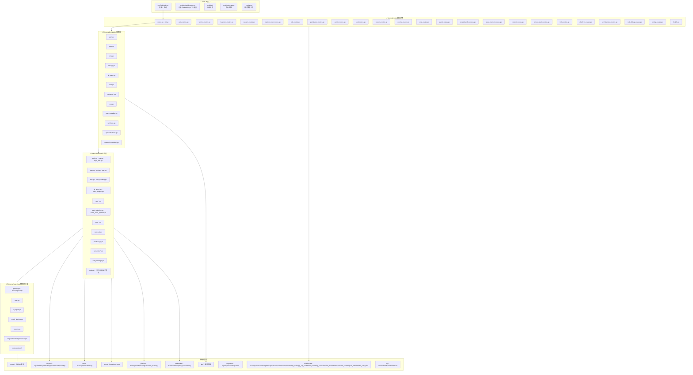
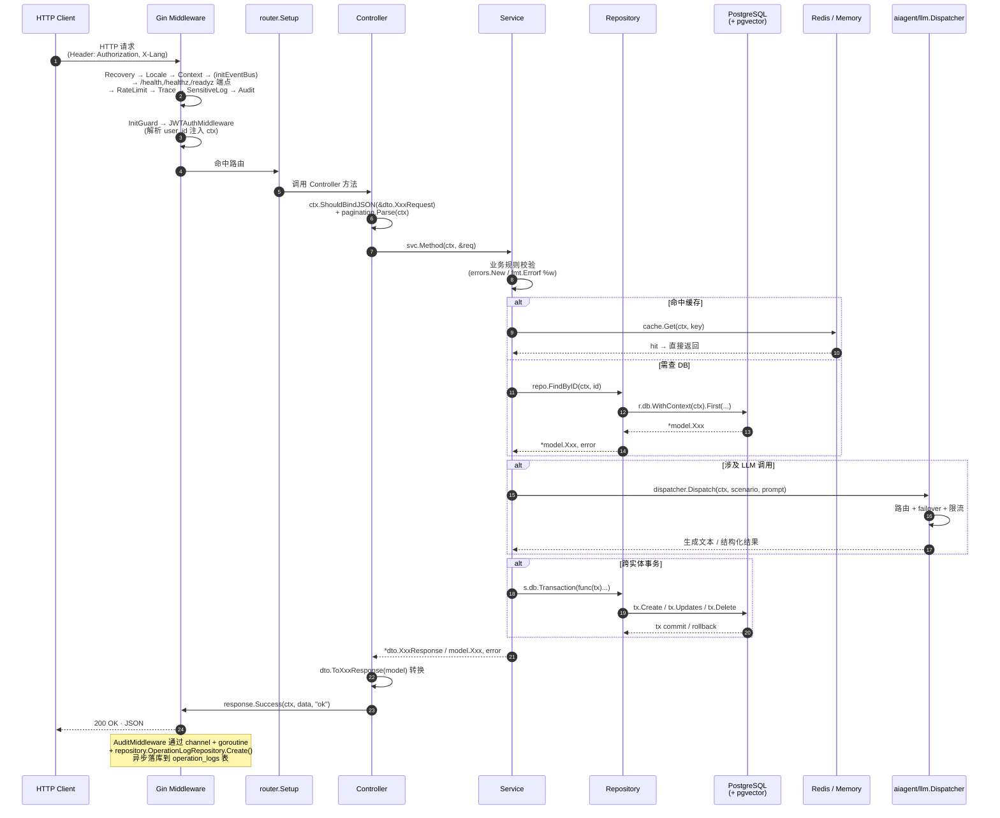
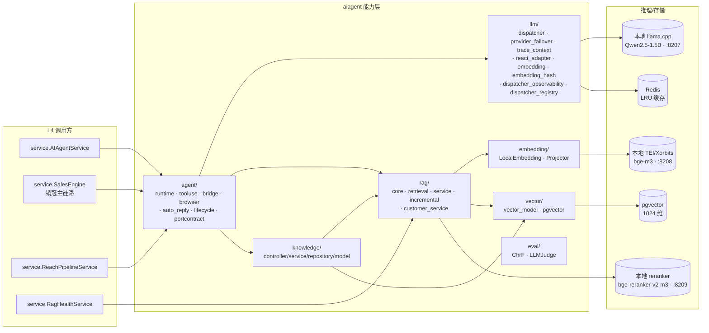
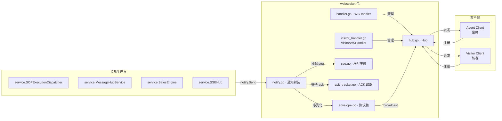
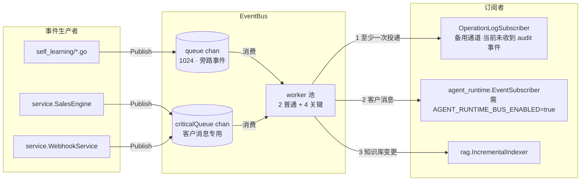
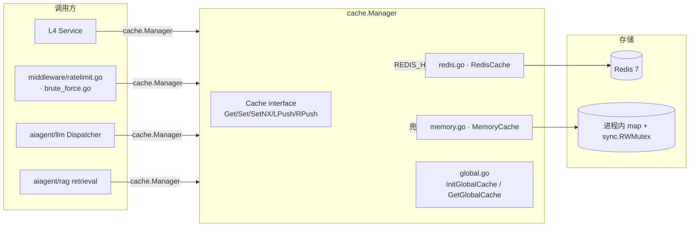

# user-server 架构图

> **规则级别**: ⭐⭐ 项目级开发文档
> **关联文档**:
> - 五层架构编码规范: [../../docs/architecture/GO_FIVE_LAYER_ARCHITECTURE.md](../../../docs/architecture/GO_FIVE_LAYER_ARCHITECTURE.md)
> - C4 系统架构图: [../../docs/architecture/ARCHITECTURE_DIAGRAM.md](../../../docs/architecture/ARCHITECTURE_DIAGRAM.md)
> - 用户体系规范: [../../docs/architecture/USER_SYSTEM.md](../../../docs/architecture/USER_SYSTEM.md)

本文档面向 `user-server` 工程内部开发，描述**代码级模块结构、分层调用时序、关键子系统、外部依赖**四类视图。
对系统级 Context / Container / Deployment 拓扑请直接阅读 [ARCHITECTURE_DIAGRAM.md](../../../docs/architecture/ARCHITECTURE_DIAGRAM.md)；
对每一层的硬约束与编码模板请阅读 [GO_FIVE_LAYER_ARCHITECTURE.md](../../../docs/architecture/GO_FIVE_LAYER_ARCHITECTURE.md)。

---

## 一、模块结构图

`user-server` 工程目录采用 Go 标准布局：`cmd/` 装配进程入口，`internal/` 强制分层 + 横向能力包。
所有业务模块都遵循 `cmd → router → controller → service → repository → model/dto` 单向依赖。



ASCII 简表（便于离线阅读）：

```
user-server/
├── cmd/{api,embedding-server,perf,routeinspect,seed}/   L1 进程装配（embedding-server 可选，Docker 不打包）
├── internal/
│   ├── router/                                 L2 路由声明（router.go + *_routes.go）
│   ├── controller/                             L3 表现层（薄 controller）
│   ├── ops/controller/ · content/controller/   L3 业务域独立子包
│   ├── service/                                L4 业务编排
│   ├── ops/service/ · content/service/         L4 业务域独立子包
│   ├── email/service/                          L4 邮件域独立子包
│   ├── service/{confidence,humanize,           L4 自闭子模块（避免循环依赖）
│   │            feedback_loop,i18n,self_learning,
│   │            orderft}
│   ├── repository/                             L5 数据访问（GORM + pgvector）
│   ├── model/                                  横向 GORM 实体
│   ├── dto/                                    横向 请求/响应
│   ├── middleware/                             横向 Gin 中间件
│   ├── cache/                                  横向 缓存抽象
│   ├── event/                                  横向 Event Bus
│   ├── websocket/                              横向 WS Hub
│   ├── platform/                               横向 平台对接 SDK
│   ├── migration/                              横向 迁移服务
│   ├── aiagent/                                能力层（agent/llm/rag/embedding/vector/eval/knowledge）
│   ├── integration/                            横向 第三方对接域
│   ├── identity/                               横向 OneID 身份统一
│   ├── etl/                                    横向 文档 ETL
│   ├── cron/                                   横向 定时任务
│   ├── domain/                                 横向 领域实体/错误码
│   ├── channelbot/                             横向 渠道机器人（telegram/whatsapp）
│   ├── config/                                 横向 平台配置加载
│   ├── content/                                横向 内容创作域（controller/service/repository/model/dto）
│   ├── email/                                  横向 邮件域（service）
│   ├── ops/                                    横向 运维域（controller/service/repository/model）
│   └── pkg/                                    通用工具（i18n/metrics/trace/testutil/utils）
├── config.yaml · config.yaml            宿主/Docker 配置
└── Dockerfile                                  多阶段构建
```

---

## 二、分层调用时序图

下图为标准 HTTP 请求（带 JWT 鉴权）从入口到 DB 的全链路时序。
其中 trace_id 由 `middleware/trace.go` 注入，跨 Service / Repository / LLM 全链路复用。



关键时序约定：

- **trace_id 透传**：`middleware/trace.go` 在 `RateLimit` 之后、`SensitiveLog` 之前注册，为请求分配 `trace_id`，写入 `context.Context`，后续 Service / Repository / Dispatcher 调用必须 `ctx` 透传，日志通过 `zerolog` 自动附带。
- **审计异步化**：`middleware/audit.go` 通过 `auditLogChan`（1000 缓冲）+ `processAuditLogs` goroutine 批量调用 `repository.OperationLogRepository.Create()` 直接异步落库到 `operation_logs` 表（每 50 条或 5s 一批，带 3 次指数退避重试）。**不经过 Event Bus**；Event Bus 中的 `OperationLogSubscriber` 当前未收到 audit 事件（备用通道，仅作为业务侧主动 Publish 的接收端）。
- **事务边界**：Service 是唯一允许 `tx.Begin()` 的层；Repository 必须提供 `*WithTx(ctx, tx, ...)` 版本配合。
- **缓存读写**：Service 控制缓存策略（TTL/防穿透），Repository **不得** 直接读写 Redis 业务缓存（仅允许访问向量缓存等基础数据）。

---

## 三、关键子系统图

### 3.1 AI Agent 子系统（`internal/aiagent/`）



依赖规则（[GO_FIVE_LAYER_ARCHITECTURE.md §六](../../../docs/architecture/GO_FIVE_LAYER_ARCHITECTURE.md)）：
- `agent/` 可调所有 aiagent 子模块；`llm/` 可调 `vector/`；`embedding/` 可调 `vector/`；`knowledge/` 仅持有静态资产。
- aiagent **被** Service 调用，**不调** 业务 Service（避免循环）。

### 3.2 WebSocket 子系统（`internal/websocket/`）



特性：每客户端独立 send chan（256 缓冲）；30s 心跳；离线消息由 `ack_tracker.go` 维护重发队列；`seq.go` 保证单连接内单调递增。

### 3.3 Event Bus 子系统（`internal/event/`）



约定：best-effort 投递，队列满时丢弃新事件并日志告警，**不阻塞主流程**；关键路径（如 SalesEngine 主链路、订单创建）**不依赖** Event Bus，必须同步走 Service 编排。

> ⚠️ **audit 不走 Event Bus**：`middleware/audit.go` 不通过 Event Bus 落库，而是通过自带 `auditLogChan`（1000 缓冲）+ `processAuditLogs` goroutine + `repository.OperationLogRepository.Create()` 直接异步落库到 `operation_logs` 表（详见 §二时序图说明）。Event Bus 中的 `OperationLogSubscriber` 当前为备用通道，仅接收业务侧主动 `Publish(operation.log, ...)` 的事件，audit 中间件不会向其投递。

### 3.4 Cache 子系统（`internal/cache/`）



策略：`REDIS_HOST` 环境变量配置时启用 Redis 后端；未配置时回退进程内缓存（单实例部署默认）。`main.go` 启动时调用 `cache.InitGlobalCache(redisClient)`；后台 janitor 由 `llm.GetGlobalDispatcher().StartCacheJanitor(cacheJanitorCtx, 60*time.Second)` 启动（**注意：janitor 由 llm Dispatcher 持有，不在 cache 包内部启动**），每 60s 清理过期项（仅内存缓存需要）。

### 3.5 Platform Adapter 子系统（`internal/platform/`）

```mermaid
graph LR
    subgraph Caller[调用方]
        Service[L4 Service]
        Main[cmd/api/main.go]
    end

    subgraph Platform[platform 包]
        Client[client.go<br/>PlatformClient]
        Sync[sync.go · InitSync]
        Adapter[adapter.go<br/>BaseAdapter + 6 平台 Adapter]
        Registry[registry.go<br/>AdapterRegistry]
        Heartbeat[heartbeat_sender.go]
        Contributor[contributor_client.go]
        AssetMarket[asset_market_client.go<br/>+ asset_market_adapter.go]
    end

    subgraph External[外部]
        PlatformSrv[(platform-server<br/>:8205)]
        Channels[渠道 API<br/>抖音/快手/小红书/闲鱼/TikTok/微信/企微]
        AssetMarketAPI[(资产市场 API)]
    end

    Main -- InitSync --> Sync
    Main -- StartHeartbeat --> Heartbeat
    Service -- 上报 / 拉取资产 --> Client
    Client --> PlatformSrv
    Heartbeat --> PlatformSrv
    Contributor --> PlatformSrv
    Adapter -- 渠道适配 --> Channels
    Registry -- 注册 --> Adapter
    AssetMarket --> AssetMarketAPI
    AssetMarket --> PlatformSrv
```



特性：平台集成是可选本地组件（`PLATFORM_ENABLED` 默认关闭，关态不发一个请求、不注册商户、不心跳），全程无授权校验、无 OTA；资产市场通过 `asset_market_client.go` 拉取平台端上架的资产，落本地 `local_asset` 表并同步版本日志。

---

## 四、与外部依赖关系

```mermaid
graph LR
    subgraph UserServer[user-server]
        API[Gin HTTP :8204]
        WS[WebSocket Hub]
        SSE[SSE Hub]
    end

    PG[(PostgreSQL 16<br/>业务主库)]
    PgVec[(pgvector<br/>knowledge_embeddings 1024 维)]
    Redis[(Redis 7<br/>缓存/分布式锁/限流)]
    LLM[(llama.cpp<br/>Qwen2.5-1.5B :8207)]
    Emb[(Embedding Server<br/>bge-m3 :8208)]
    Rerank[(Reranker<br/>bge-reranker-v2-m3 :8209)]
    Platform[(platform-server :8205<br/>可选·仅 PLATFORM_ENABLED=true)]
    Obs[(对象存储<br/>local ./uploads 或云 OBS)]
    Channels[渠道 API<br/>微信/企微/抖音/快手/<br/>小红书/闲鱼/TikTok/<br/>飞书/钉钉/WhatsApp/<br/>Telegram/SMS/Email]
    DeepL[(DeepL API<br/>可选·低资源语言翻译降级)]
    Browser[chromedp<br/>浏览器自动化自动回复]

    API --> PG
    API --> PgVec
    API --> Redis
    API --> LLM
    API --> Emb
    API --> Rerank
    API --> Obs
    API --> Channels
    API --> DeepL
    API --> Browser
    WS --> Redis
    SSE --> Redis
    API -. 心跳/资产同步（仅开态） .-> Platform
    API -- Webhook 回调 <-- Channels
```

关键约定：

- **PostgreSQL + pgvector 同库**：业务表与向量索引共用一个 PG 实例，避免跨库事务。
- **本地推理栈默认**：`config.yaml` 中 `inference.embedding.mode=local`、`inference.llm.mode=local`，私域部署强制本地，数据不出域。
- **Redis 可选**：未配置时回退进程内缓存；多实例部署必须配置以获得跨实例幂等（如 reply guard、限流计数）。
- **渠道 API 出站**：仅当用户配置对应渠道账号时才出站；Webhook 入站统一走 `/api/webhook/{platform}/{id}`。
- **对象存储**：两条独立通路。① `config.yaml` 的 `storage` 块（`type=qiniu` + `${QINIU_ACCESS_KEY}` / `${QINIU_SECRET_KEY}` / `${QINIU_BUCKET}` / `${QINIU_DOMAIN}` 插值）只服务访客上传凭证 `GET /api/chat/public/upload-token`；守卫只看两项——`type != "qiniu"` 或 `access_key` 为空即 503「对象存储未配置」，`secret_key`/`bucket`/`domain` 缺失不报错但会签出不可用的 token（`upload_domain` 缺省回落 `up-z2.qiniup.com`）。② `obs_config` 表（provider ∈ `local`/`aliyun`/`qiniu`/`tencent`/`aws`）服务渠道媒体转存，启动时 `InitDefaultStorageIfEmpty` 仅在表为空时 seed 一条 `local` 配置（base dir 取 `STORAGE_LOCAL_BASE_DIR`，默认 `./uploads`；公开前缀取 `STORAGE_LOCAL_PUBLIC_URL`，默认 `/files`），因此不接任何云也能跑。
- **platform-server 可选**：`:8205` 只在 `PLATFORM_ENABLED=true` 时接入（见 §启动装配的开关分支）；默认关态下不加载配置、不心跳、不发一个出站请求，本地资产与运行链路不依赖它。
- **chromedp**：仅在自动回复场景（抖音/小红书/快手/闲鱼）启用，Dockerfile 默认注释，需手动取消注释安装 chromium。

---

## 五、启动装配顺序

`cmd/api/main.go` 启动顺序固定（不可调整），任何破坏顺序的改动都会导致审计/路由决策静默失败：

```mermaid
graph TD
    LoadCfg[1. logger.InitLogger<br/>config.GetLoggingConfig]
    RedisInit[2. redisClient := buildRedisClient<br/>+ cache.InitGlobalCache(redisClient)<br/>+ router.SetHealthRedis]
    DBInit[3. db.InitDB<br/>+ db.AutoMigrate]
    DispInit[4. llm.InitGlobalDispatcherWithDB<br/>+ service.SetAgentLoopTimeout]
    IntentInit[5. service.InitIntentRecognizer<br/>+ llm.InitDefaultAlertHook]
    Janitor[6. llm.GetGlobalDispatcher<br/>.StartCacheJanitor 60s]
    PlatformInit[7. platformconfig.LoadPlatform<br/>+ platform.InitSync（注册协程读 PlatformCfg，须在后）]
    InstallStatus[8. middleware.InitInstallStatus<br/>+ 开态才跑 platform.StartHeartbeat]
    Migrate[9. migration.NewMigrationService<br/>同步等待迁移完成]
    Failover[10. llm.InitGlobalFailover<br/>+ Start]
    TraceBus[11. llm.InitGlobalTraceBus]
    SSEHub[12. service.InitGlobalSSEHub]
    SOP[13. service.InitSOPScheduler<br/>+ InitSOPExecutionDispatcher<br/>+ InitSOPOutboxDispatcher<br/>+ InitSOPStuckDetector]
    ConfAgg[14. service.InitConfidenceAggregator<br/>+ InitHumanizeEvalService<br/>+ InitFeedbackCollector]
    FBL[15. service.InitFeedbackLoopComponents<br/>+ NewFeedbackLoopCron]
    Memory[16. service.InitMemorySystem]
    EventSub[17. registerEventSubscribers<br/>仅 AGENT_RUNTIME_BUS_ENABLED=true 时订阅<br/>customer.message.received<br/>knowledge.document.changed 始终订阅]
    Router[18. router.Setup r]
    Serve[19. endless.ListenAndServe :8204]

    LoadCfg --> RedisInit --> DBInit --> DispInit --> IntentInit --> Janitor
    Janitor --> PlatformInit --> InstallStatus --> Migrate --> Failover
    Failover --> TraceBus --> SSEHub --> SOP --> ConfAgg --> FBL
    FBL --> Memory --> EventSub --> Router --> Serve
```

任何全局单例的 `Init*` 必须在 `router.Setup` 之前完成；`router.Setup` 内部按需 `GetGlobal*` 注入到对应 Controller / Webhook / SmartOrchestrator。

> ℹ️ **步骤 13 拆解**：实际包含 4 个独立初始化——`InitSOPScheduler` / `InitSOPExecutionDispatcher` / `InitSOPOutboxDispatcher` / `InitSOPStuckDetector`，每个返回的实例都通过 `defer .Stop(ctx)` 注册关闭。
>
> ℹ️ **步骤 17 条件订阅**：`registerEventSubscribers()` 中 `customer.message.received` 仅当 `AGENT_RUNTIME_BUS_ENABLED=true` 时才订阅（默认关闭，避免僵尸订阅者）；`knowledge.document.changed` 始终订阅。

---

## 六、相关文档导航

| 主题 | 文档路径 |
| --- | --- |
| 五层架构硬约束 + 编码模板 | [../../docs/architecture/GO_FIVE_LAYER_ARCHITECTURE.md](../../../docs/architecture/GO_FIVE_LAYER_ARCHITECTURE.md) |
| 系统级 C4 / Container / Deployment | [../../docs/architecture/ARCHITECTURE_DIAGRAM.md](../../../docs/architecture/ARCHITECTURE_DIAGRAM.md) |
| 用户/角色/授权三模块 | [../../docs/architecture/USER_SYSTEM.md](../../../docs/architecture/USER_SYSTEM.md) |
| 菜单与权限设计 | [../../docs/architecture/MENU_PERMISSION_PLAN.md](../../../docs/architecture/MENU_PERMISSION_PLAN.md) |
| 营销功能模块索引（94+ 子模块） | [../../docs/marketing-features/README.md](../../../docs/marketing-features/README.md) |
| host 推理栈部署方案 | [../../docs/architecture/HOST_INFERENCE_PLAN.md](../../../docs/architecture/HOST_INFERENCE_PLAN.md) |
| ADR 决策记录（当前仅有 ADR-001/002/003/004，ADR-008 待补） | [../../../docs/architecture/adr/](../../../docs/architecture/adr/) |
| 工程级 README | [../README.md](../../README.md) |
| 函数清单 | `user-server/NEW_FUNCTIONS_INVENTORY.md`（机器生成，.gitignore 排除，不入库） |
| 代码开发手册 | [./DEVELOPMENT.md](./DEVELOPMENT.md) |
| 代码规范 | [./CONVENTIONS.md](./CONVENTIONS.md) |
| 功能清单 | [./FEATURES.md](./FEATURES.md) |

> ℹ️ **Event Bus ADR 待补**：`main.go` 的 `registerEventSubscribers()` 注释曾引用 `ADR-008 §2.2`，但 `ADR-008` 实为「触达限流策略」（且已合并进 `docs/operations/SLA_SLO.md`），与 Event Bus 无关。
> 现行 ADR 目录为 001~015 共 14 份，其中 **ADR-003 已作废、缺号不复用**（缺号说明见 [adr/README.md](../../../docs/architecture/adr/README.md)）。Event Bus 订阅者注册规范暂无对应 ADR，补写时请从 **ADR-016** 起顺延；在补齐之前，相关注释已在 `main.go` 中改为说明性描述。

---

最近更新日期: 2026-07-26
