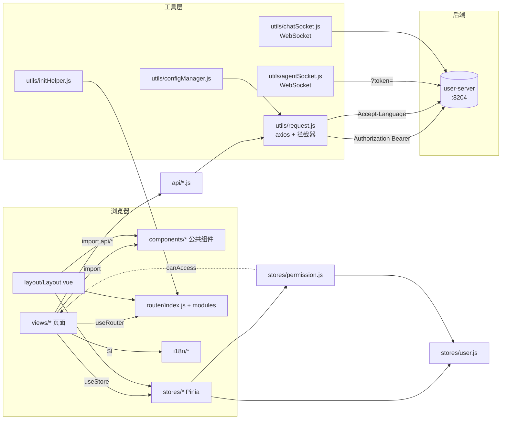
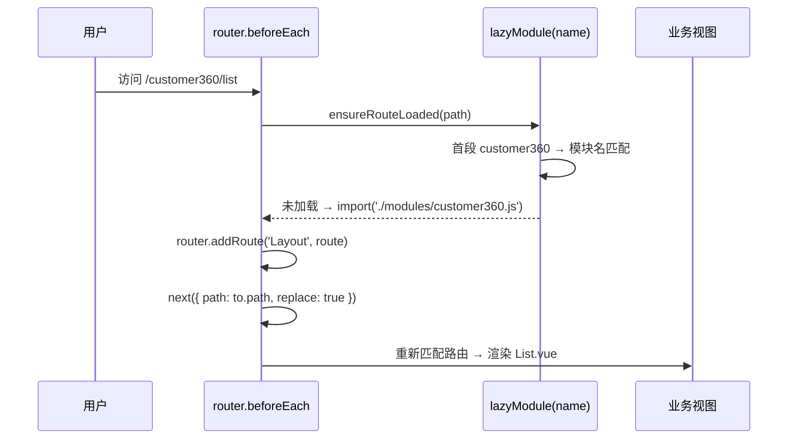
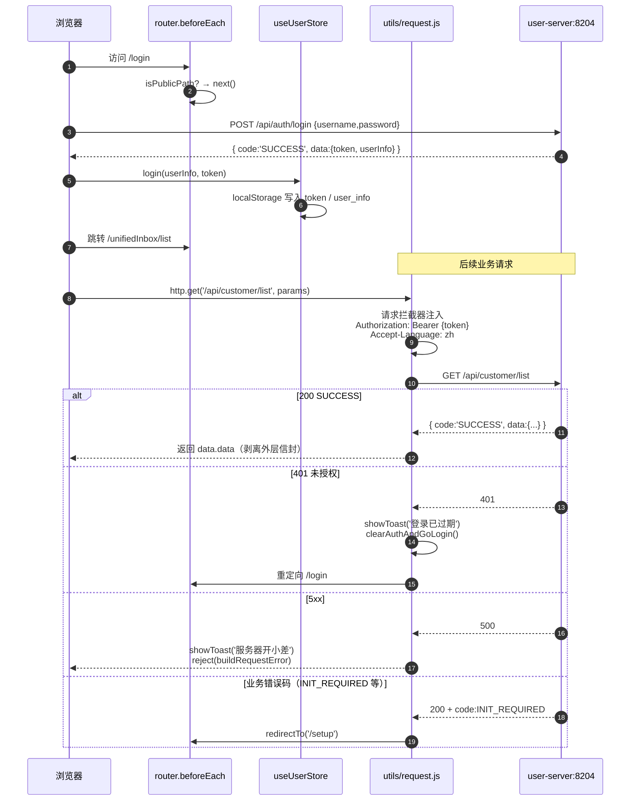
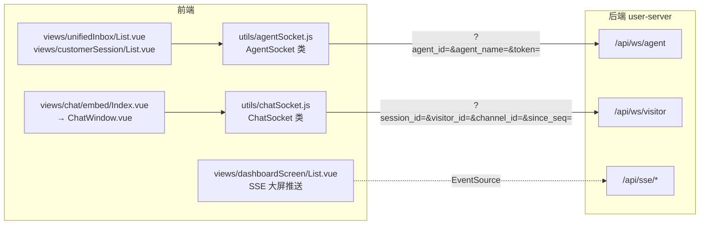

# user-web 架构图

> **规则级别**: ⭐⭐ 项目级开发文档

本文档基于 `user-web` 实际代码梳理，描述整体目录结构、模块依赖、路由组织、状态管理、与后端 `user-server` 的交互、实时通道架构以及多渠道前端接入方式。所有内容均取自仓库现有源码，未做臆测。

## 1. 整体目录结构图

```text
user-web/
├── public/                          # 静态资源（favicon.svg 等，原样拷贝到 dist/）
├── src/
│   ├── api/                         # 业务 API 模块（按业务域拆分，78 个文件）
│   │   ├── customer360.js           #   - 老风格：import request from '@/utils/request'
│   │   ├── knowledge.js             #   - 新风格：import { http } from '@/utils/request'
│   │   ├── aiAgent.js
│   │   └── ... 共 78 个文件
│   ├── components/                  # 公共组件
│   │   ├── Breadcrumb.vue
│   │   ├── PageHeader.vue           #   通用页头（标题/操作槽）
│   │   ├── PageState.vue            #   空状态/加载统一占位
│   │   ├── LanguageSwitcher.vue     #   顶栏语言切换
│   │   ├── MessageNotification.vue  #   全局消息通知（顶栏铃铛宿主）
│   │   ├── SubMenuItem.vue          #   Layout 侧边栏递归菜单项
│   │   ├── dialogs/
│   │   │   └── MaterialSelectDialog.vue
│   │   ├── SimpleEditor/
│   │   │   └── index.vue            #   轻量富文本编辑器封装
│   │   ├── AgentBindingDialog.vue   #   AI 智能体 ↔ 渠道 绑定对话框
│   │   ├── AgentMountDialog.vue     #   AI 智能体挂载到客服
│   │   ├── ReachChannelSelector.vue #   触达渠道多选
│   │   ├── WeComSendDialog.vue      #   企微发送对话框
│   │   └── {Douyin,Kuaishou,Xiaohongshu,TikTok}CardPreview.vue   # 各平台卡片预览组件
│   ├── constants/                   # 业务常量（status / role / source / msgType 等 21 个枚举）
│   │   ├── index.js                 #   汇总出口
│   │   └── *.js                     #   每类常量一个文件（accountType、aiAgentType、cardPlatform …）
│   ├── i18n/                        # 国际化（vue-i18n 9 + Vite 预编译）
│   │   ├── index.js                 #   createI18n 实例（legacy:false 组合式）
│   │   ├── locale.js                #   getStoredLocale / applyDirection（RTL 支持）
│   │   └── locales/
│   │       ├── zh.json              #   中文（默认 + fallback）
│   │       ├── en.json              #   英文
│   │       ├── ja.json              #   日文
│   │       └── ar.json              #   阿拉伯文（RTL，applyDirection 处理 dir=rtl）
│   ├── layout/
│   │   └── Layout.vue               # 主布局：顶栏 + 侧边栏 + 主内容区 + MessageNotification
│   ├── router/
│   │   ├── index.js                 # 路由主文件（createWebHashHistory + 懒加载守卫）
│   │   └── modules/                 # 60+ 业务路由模块（每个文件 default 导出路由数组）
│   ├── stores/                      # Pinia 状态管理（Composition 风格）
│   │   ├── index.js                 #   createPinia + 持久化（按需）
│   │   ├── user.js                  #   登录态 / 用户信息 / token
│   │   ├── permission.js            #   角色与权限判定（依赖 user.js）
│   │   ├── app.js                   #   全局 UI 状态（侧边栏折叠、首次访问标记等）
│   │   └── material.js              #   素材/话题/分类业务数据
│   ├── styles/
│   │   ├── index.scss               # 全局样式入口
│   │   ├── reset.scss               # 样式重置
│   │   └── variables.scss           # SCSS 变量（颜色、间距、断点）
│   ├── types/
│   │   └── components.d.ts          # unplugin-vue-components 自动生成的组件类型声明
│   ├── utils/
│   │   ├── request.js               # axios 实例 + 拦截器（JWT / 错误 / loading / 语言）
│   │   ├── configManager.js         # API 配置持久化（localStorage 'apiConfig'）
│   │   ├── initHelper.js            # 系统初始化检测（isInitialized 守卫）
│   │   ├── agentSocket.js           # 坐席 WebSocket 客户端（/api/ws/agent）
│   │   ├── chatSocket.js            # 访客 WebSocket 客户端（/api/ws/visitor）
│   │   ├── iconMap.js               # 菜单/路由图标映射
│   │   ├── list.js                  # 列表通用辅助（分页、过滤参数构造等）
│   │   └── map.js                   # 地图相关辅助
│   ├── views/                      # 业务页面（按域分组，60+ 子目录）
│   │   ├── KnowledgeWorkspace/      #   知识库工作台（10 个子组件）
│   │   ├── RagProductConfig/        #   RAG 产品配置容器页
│   │   ├── chat/embed/              #   公开嵌入聊天窗（ChatWindow + 子组件）
│   │   ├── setup/InitSetup.vue      #   系统初始化向导
│   │   ├── aiAgent/、customer360/、knowledge/、sms/、email/ ... 60+ 业务目录
│   │   ├── Login.vue / Profile.vue / Notifications.vue / NotFound.vue
│   │   └── ...
│   ├── App.vue                     # 根组件
│   └── main.js                     # 入口（createApp + router + pinia + ElementPlus + i18n）
├── tests/
│   ├── e2e/                        # Playwright E2E 测试
│   │   ├── audit/                  #   各模块 UI 审计快照（JSON）
│   │   ├── auth.setup.spec.js      #   登录态 setup
│   │   ├── *.spec.js               #   业务场景用例
│   │   └── UI_AUDIT_REPORT.md
│   └── API_INVENTORY.json / API_CHECKLIST.md / API_TEST_RESULTS.json   # API 联调清单与结果
├── .env.development                # VITE_API_BASE_URL=/
├── .env.production
├── vite.config.js                 # Vite 配置（别名 @、按需导入、分包、/api 代理到 8204）
├── vitest.config.js
├── playwright.config.js            # baseURL 默认 http://localhost:5173
├── eslint.config.recommended.mjs   # 推荐的 ESLint 配置（未启用）
├── check_menu.mjs / check_menu2.mjs / check_menu3.mjs   # 菜单 / 路由一致性巡检脚本
├── package.json
└── README.md / MENU_SPEC.md
```

> 上述目录根据 `user-web/src/` 实际文件整理；`api/`、`router/modules/`、`views/` 的完整清单见 [FEATURES.md](./FEATURES.md)。

## 2. 模块依赖图



### 关键依赖说明

| 起点节点 | 终点节点 | 关系描述 |
| --- | --- | --- |
| `views/*` | `api/*` | 所有页面通过 `src/api/` 调用接口，**禁止在组件中直接 `import axios`** |
| `api/*` | `utils/request.js` | 统一通过 `http` 命名导出（新代码）或 default 导出（历史代码）调用 |
| `utils/request.js` | `stores/user.js` | 请求拦截器从 `localStorage` 读取 token，与 store 共享存储键 |
| `stores/permission.js` | `stores/user.js` | 通过 `storeToRefs(userStore)` 拿 `role` 派生权限 |
| `router/index.js` | `utils/initHelper.js` | `beforeEach` 中调用 `isInitialized()` 守卫未初始化场景 |
| `layout/Layout.vue` | `components/SubMenuItem.vue` | 侧边栏递归渲染菜单树 |

## 3. 路由结构图

路由采用 **WebHash 模式**（`createWebHashHistory`），主结构为单 `Layout` + 子路由懒加载。

```mermaid
graph TD
    Root["/ (Layout)"]
    Root --> Workspace["工作台"]
    Root --> Customer["客户管理"]
    Root --> AIAgent["AI 智能体"]
    Root --> Knowledge["知识库"]
    Root --> Reach["营销触达"]
    Root --> Community["社媒运营"]
    Root --> Analytics["分析洞察"]
    Root --> System["系统管理<br/>(仅 admin)"]

    Workspace --> Inbox["/unifiedInbox/list<br/>统一收件箱"]
    Workspace --> Sess["/customerSession/list<br/>客服会话"]
    Workspace --> Msg["/unifiedMessage/list<br/>统一消息"]
    Workspace --> Hub["/messageHub/list<br/>消息中台"]
    Workspace --> Wecom["/wecomAccount/list<br/>企微账号"]

    Customer --> C360["/customer360/list"]
    Customer --> CEvt["/customerEvent/list"]
    Customer --> Clue["/clue/list + /clue/statistics"]
    Customer --> Tag["/tagSegmentation/list"]
    Customer --> Seg["/userSegment/list (RFM)"]
    Customer --> ChCh["/chatChannel/list"]

    AIAgent --> Agent["/aiAgent/list + /create + /edit/:id"]
    AIAgent --> DMem["/dialogueMemory/list"]
    AIAgent --> Intent["/intentRecognition/list"]
    AIAgent --> Obj["/objection/list"]
    AIAgent --> Pers["/persona/list"]
    AIAgent --> Sop["/sopAgent/list"]
    AIAgent --> Scr["/scriptTemplate/list"]
    AIAgent --> LLM["/llmRouting/list"]
    AIAgent --> Tune["/confidence /humanize /feedbackLoop<br/>(tuning 模块)"]
    AIAgent --> AssetM["/asset-market + /my-assets"]

    Knowledge --> KM["/knowledge/management"]
    Knowledge --> KT["/knowledge/tokens"]
    Knowledge --> KP["/knowledge/playground"]
    Knowledge --> KC["/knowledge/chunks"]
    Knowledge --> KExt["/knowledge/external"]
    Knowledge --> KO["/knowledge/openapi"]
    Knowledge --> KStat["/knowledge/statistics"]
    Knowledge --> KFb["/knowledge/feedbacks"]
    Knowledge --> KBI["/knowledge/batch-import"]
    Knowledge --> TM["/templateMarket/list"]
    Knowledge --> Rag["/system/rag-* 概览/产品/账号"]

    Reach --> MF["/marketingFlow/list"]
    Reach --> RP["/reachPipeline/list"]
    Reach --> SMS["/sms/* (list/drafts/jobs/config)"]
    Reach --> Email["/email/* (list/drafts/jobs/smtp/info/guide)"]
    Reach --> TikTok["/tiktok + /tiktok/*"]
    Reach --> Douyin["/douyinCard + /douyin/*"]
    Reach --> Kuaishou["/kuaishouCard + /kuaishou/*"]
    Reach --> XHS["/xiaohongshuCard + /xiaohongshu/*"]
    Reach --> Xianyu["/xianyuCard + /xianyu/*"]
    Reach --> BO["/batchOperation/list"]
    Reach --> LC["/livecode"]
    Reach --> SL["/shortLink + /shortLink/stats"]

    Community --> Comm["/community/list"]
    Community --> TG["/telegram/account"]
    Community --> FS["/feishu/account"]
    Community --> WA["/whatsapp/* (account/drafts/jobs/group-messaging)"]
    Community --> DP["/domainPool"]
    Community --> CSvc["/customerService/* (agentStatus/quickReply/sessionTag/aiSuggestion)"]

    Analytics --> AiPr["/aiProductivity/list"]
    Analytics --> CF["/conversionFunnel/list"]
    Analytics --> CJ["/customerJourney/dashboard"]
    Analytics --> DS["/dashboardScreen/list"]
    Analytics --> CR["/customReport/list"]
    Analytics --> AB["/abExperiment/list"]
    Analytics --> CP["/churnPrediction/list"]

    System --> PA["/platformAccount/list"]
    System --> TU["/teamUser/list + /teamUser/role"]
    System --> Sys["/system/config"]
    System --> Mat["/system/material-library"]
    System --> Mon["/system/monitor"]
    System --> Obs["/system/obs-config"]
    System --> Integ["/integration/list"]
    System --> OL["/operationLog/list"]
    System --> SA["/securityAudit/list"]
    System --> BK["/backup/list"]
    System --> Gd["/system/guide"]

    Root --> Standalone["独立路由（非菜单）<br/>/login /setup /profile /notifications<br/>/chat/embed/:channel_ref<br/>/oneid/list /oneid/conflicts<br/>/asset-market/detail/:id /asset-market/sync-log"]
```



### 路由懒加载机制

`router/index.js` 使用 `import.meta.glob('./modules/*.js')` 静态收集所有模块文件，运行时按访问路径的首段匹配模块名，再 `await lazyModule(name)()` 动态 `import()` 并 `router.addRoute('Layout', route)` 注入。特殊路径（如 `douyin-card-stats/:id`）通过 `pathToModule` 显式映射到对应模块。



## 4. 状态管理图

Pinia 采用 Composition 风格（`defineStore('id', () => {...})`），store 之间显式依赖。

```mermaid
graph LR
    UserStore["useUserStore<br/>token / userInfo / isLoggedIn<br/>isAdmin / role"]
    PermStore["usePermissionStore<br/>canAccess / hasRole / hasMenuPermission"]
    AppStore["useAppStore<br/>侧边栏折叠、首次访问标记<br/>账号/素材页刷新状态"]
    MatStore["useMaterialStore<br/>materials / topics / categorys"]

    PermStore -->|storeToRefs(role)| UserStore
    UserStore -->|localStorage: token<br/>user_info| LS[(localStorage)]
    MatStore -->|内存| Material[(素材/话题<br/>分类列表)]
    AppStore -->|内存| UIState[(UI 状态)]

    Views[views/*] --> UserStore
    Views --> PermStore
    Views --> AppStore
    Views --> MatStore
    RouterGuard["router.beforeEach<br/>requiresAdmin / requiresAuth"] --> UserStore
    Layout["Layout.vue"] --> PermStore
    Layout --> UserStore
```

| Store | 文件 | 职责 | 持久化方式 |
| --- | --- | --- | --- |
| `user` | `stores/user.js` | token、用户信息、登录态、角色 | `localStorage.token` + `localStorage.user_info` |
| `permission` | `stores/permission.js` | 角色等级判定（viewer…owner）、菜单可见性 | 无（派生自 user.role） |
| `app` | `stores/app.js` | UI 折叠、首次访问标记 | 仅内存 |
| `material` | `stores/material.js` | 素材/话题/分类列表缓存 | 仅内存 |

## 5. 与 user-server 的交互时序图

### 5.1 登录与 API 请求全链路



### 5.2 拦截器关键逻辑

| 阶段 | 处理逻辑 |
| --- | --- |
| 请求拦截 | 从 `localStorage.token` 读取 → 注入 `Authorization: Bearer`；注入 `Accept-Language` 给后端做本地化 |
| 成功响应 | 兼容 `code === 'SUCCESS' \|\| 200 \|\| 0` → 返回 `data.data`；`responseType: 'blob'` 直接透传 Blob |
| 业务码跳转 | `INIT_REQUIRED` → `/setup`；通过 `INIT_REDIRECT_MAP` 扩展 |
| 401 | 清除 token + 跳 `/login`，并通过 `lastToastMsg` 2500ms 去重避免并发弹多条 |
| 403 / 404 / 429 / 5xx | 走 `t('http.*')` 国际化文案统一弹窗 |
| 非 JSON 兜底 | 反向代理层 把 404 兜底成前端 HTML 时识别并提示"响应异常" |
| `_silent` 标记 | 调用方传 `{ _silent: true }` 关闭统一 toast，自行处理错误 |

## 6. WebSocket / SSE 实时通道架构

user-web 共存在两条 WebSocket 通道与若干 SSE 推送场景。



### 6.1 AgentSocket（坐席侧）

- **端点**：`/api/ws/agent?agent_id=&agent_name=&token=`
- **鉴权**：浏览器 WebSocket 无法自定义 header，token 通过 `?token=` 携带（后端仅对 `Upgrade=websocket` 放行该回退）
- **下行事件**：`new_session` / `new_message` / `session_update` / `ai_suggestion` / `pong` / `heartbeat`
- **上行事件**：`ping`（25s 心跳）/ `ack`（批量合并 200ms 窗口）
- **鲁棒性**：
  - 重连：指数退避 2s→4s→8s→16s→30s，封顶 10 次
  - `lastSeq` 持久化到 `localStorage`（key: `agentSocket:lastSeq:{agentId}`）
  - 乱序/重复通过 `seenSeqs` 去重
- **使用场景**：客服工作台、统一收件箱实时刷新

### 6.2 ChatSocket（访客侧，嵌入聊天窗）

- **端点**：`/api/ws/visitor?session_id=&visitor_id=&channel_id=&since_seq=`
- **下行事件**：`welcome` / `offline_messages` / `message` / `agent_joined` / `session_closed` / `ai_typing` / `missed_ack` / `pong`
- **上行事件**：`ping` / `ack` / `resume`（重连后增量补发）/ `delivered`（旧协议兼容）/ `close`
- **鲁棒性**：
  - 重连：指数退避 1s→30s，无最大次数（私域长连接）
  - `lastSeq` 持久化到 `sessionStorage`（key: `chatSocket:lastSeq:{sessionId}:{visitorId}`）
  - `onopen` 自动 flush pending acks；`since_seq` 让服务端走精确路径补发

### 6.3 SSE 大屏推送

`views/dashboardScreen/List.vue` 通过 `EventSource` 订阅 `/api/sse/*`，由后端推送营销 KPI 与图表数据。前端不需要鉴权 header（依赖 cookie 或 query token）。

## 7. 渠道集成前端接入图

```mermaid
graph LR
    subgraph 渠道前端模块
        TikTok["tiktokCard/*<br/>TikTokCardPreview.vue"]
        Douyin["douyinCard/*<br/>DouyinCardPreview.vue"]
        Kuaishou["kuaishouCard/*<br/>KuaishouCardPreview.vue"]
        XHS["xiaohongshuCard/*<br/>XiaohongshuCardPreview.vue"]
        Xianyu["xianyuCard/*<br/>(无独立预览组件)"]
    end

    subgraph 自动回复（私信接管）
        AutoT["tiktokAutoReply.js"]
        AutoX["xianyuAutoReply.js"]
        AutoD["douyinCard/AutoReply.vue"]
        AutoK["kuaishouCard/AutoReply.vue"]
        AutoXHS["xiaohongshuCard/AutoReply.vue"]
    end

    subgraph 通讯渠道
        TG["telegram/account.vue"]
        FS["feishu/FeishuAccount.vue"]
        WA["whatsapp/WhatsappAccount.vue<br/>+ whatsappBot/BulkMessaging.vue"]
        WCom["wecomAccount/List.vue"]
        DT["dingtalkApp/DingtalkAppAccount.vue"]
        WC["whatsappCloud/WhatsappCloudAccount.vue"]
        Mail["email/EmailList.vue<br/>+ smtp/info/jobs/guide"]
        SMS["sms/List.vue<br/>+ drafts/jobs/config"]
    end

    subgraph 嵌入 SDK
        EmbedSDK["chat/embed/Index.vue<br/>→ ChatWindow.vue<br/>(/chat/embed/:channel_ref)"]
    end

    subgraph 后端
        Server[(user-server<br/>多渠道适配器)]
    end

    TikTok --> Server
    Douyin --> Server
    Kuaishou --> Server
    XHS --> Server
    Xianyu --> Server

    AutoT --> Server
    AutoX --> Server
    AutoD --> Server
    AutoK --> Server
    AutoXHS --> Server

    TG --> Server
    FS --> Server
    WA --> Server
    WCom --> Server
    DT --> Server
    WC --> Server
    Mail --> Server
    SMS --> Server

    EmbedSDK --> Server
```

### 渠道接入要点

| 渠道类型 | 前端入口 | 接入方式 |
| --- | --- | --- |
| 抖音 / 快手 / 小红书 / 闲鱼 / TikTok 卡片 | `views/{platform}Card/{List,Stats,CardStats,AutoReply}.vue` | 同构页面结构，差异仅在 API 路径与平台标识 |
| 自动回复 | `views/{platform}Card/AutoReply.vue` + `api/{tiktok|xianyu}AutoReply.js` | 浏览器自动化接管私信，仅 TikTok / 闲鱼 拆独立 API 文件 |
| Telegram / 飞书 / WhatsApp / 企微 / 钉钉 | `views/{platform}/*Account.vue` | 通过账号管理 + Webhook 注册 + AI 智能体绑定 |
| WhatsApp Cloud (Meta 商业 API) | `views/whatsappCloud/WhatsappCloudAccount.vue` | 官方 API 接入，区别于扫码登录的私有部署 |
| 邮件 / 短信 | `views/email/*` / `views/sms/*` | 触达管道，含草稿 / 任务 / 配置子页 |
| 嵌入式客服 | `/chat/embed/:channel_ref` | 第三方网站通过 iframe 加载，`channel_ref` 对应 `chatChannel` AppKey |

## 8. 关键设计要点汇总

1. **路由懒加载**：60+ 模块按需下载，首屏只加载 `Layout` + `Profile` + `Notifications` 常驻路由；首次访问 `/customer360/list` 才会下载 `router/modules/customer360.js` 与 `views/customer360/List.vue`。
2. **API 调用统一收口**：所有请求经 `utils/request.js`，组件禁止直接 `import axios`；新增代码必须使用 `import { http } from '@/utils/request'`（详见 [CONVENTIONS.md](./CONVENTIONS.md) 禁止清单）。
3. **JWT 与多语言联动**：每次请求自动注入 `Authorization` 与 `Accept-Language`，后端返回的本地化业务提示直接由前端 toast 展示。
4. **WebSocket 鲁棒性**：seq 跟踪 + 持久化 + 批量 ack + 指数退避，覆盖跨页面刷新 / 短暂断网场景。
5. **CSP 友好的 i18n**：通过 `@intlify/unplugin-vue-i18n` 在构建期预编译消息，避免运行期 `new Function` 触发 CSP `unsafe-eval`。
6. **分包策略**：`vite.config.js` 将 `vue/router/pinia`、`element-plus`、`axios` 拆为独立 chunk，减小首屏体积。
7. **公开嵌入页**：`/chat/embed/:channel_ref` 标记 `meta.public = true` 且 `requiresAuth = false`，不进入主 Layout，可被第三方 iframe 加载。

## 关联文档

- [DEVELOPMENT.md](./DEVELOPMENT.md) - 代码开发手册
- [CONVENTIONS.md](./CONVENTIONS.md) - 代码规范
- [FEATURES.md](./FEATURES.md) - 功能清单
- [../README.md](../../README.md) - 项目说明
- [../../MENU_SPEC.md](../ui-inventory/MENU_SPEC.md) - 菜单页面规格清单

---

最近更新日期: 2026-07-26
