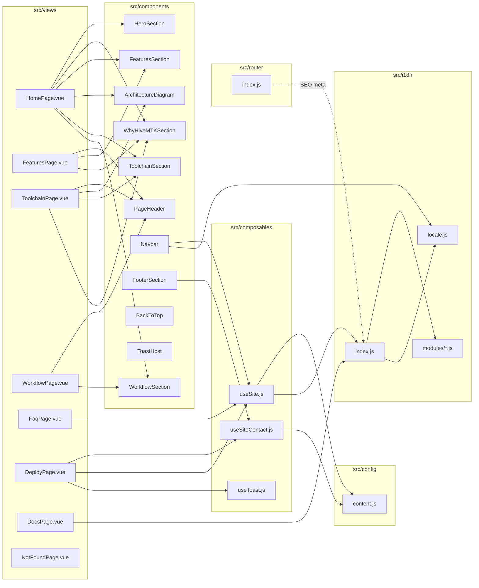
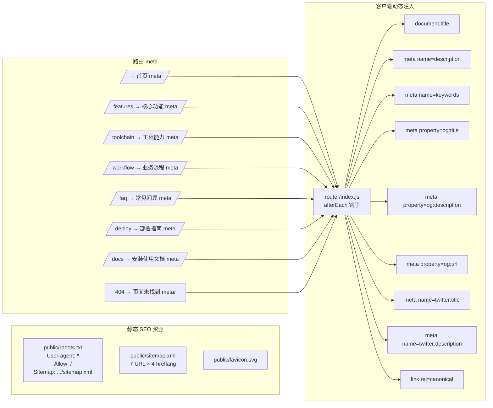
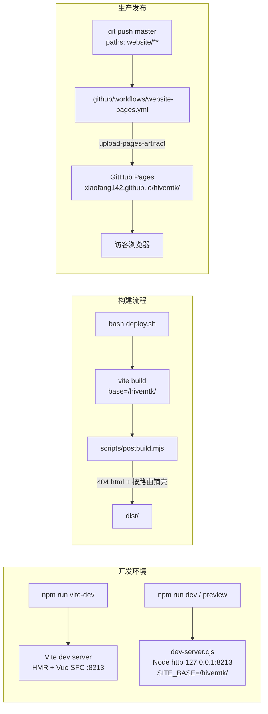

# website 架构图

> **规则级别**: ⭐⭐ 项目级开发文档

本文档描述 HiveMTK 官网 (`hivemtk/website`) 的整体架构、模块依赖、路由结构、多语言机制、SEO 体系与部署架构。所有图示均基于实际代码绘制，命名与文件路径一一对应。

关联文档：
- 项目总览：[../../README.md](../../README.md)
- 菜单规格：[../../MENU_SPEC.md](../../MENU_SPEC.md)
- 术语规范：[../../TERMINOLOGY.md](../../TERMINOLOGY.md)
- 开发手册：[./DEVELOPMENT.md](./DEVELOPMENT.md)
- 代码规范：[./CONVENTIONS.md](./CONVENTIONS.md)
- 功能清单：[./FEATURES.md](./FEATURES.md)

---

## 一、整体目录结构

```
website/
├── public/                       # 静态资源（构建时直接拷贝到 dist/）
│   ├── favicon.svg               # 站点图标
│   ├── robots.txt                # 爬虫协议（指向 sitemap.xml）
│   ├── sitemap.xml               # SEO sitemap（含 4 语言 hreflang）
│   └── wechat.jpg                # 联系方式微信二维码
├── scripts/
│   └── postbuild.mjs             # vite build 后处理：404.html + 按路由铺 <route>/index.html
├── src/
│   ├── components/               # 展示组件（无路由，纯 SFC）
│   │   ├── ArchitectureDiagram.vue
│   │   ├── BackToTop.vue
│   │   ├── FeaturesSection.vue
│   │   ├── FooterSection.vue
│   │   ├── HeroSection.vue
│   │   ├── Navbar.vue
│   │   ├── PageHeader.vue
│   │   ├── ToastHost.vue
│   │   ├── ToolchainSection.vue
│   │   ├── WhyHiveMTKSection.vue
│   │   └── WorkflowSection.vue
│   ├── composables/              # 组合式函数
│   │   ├── useSite.js             # 把 content.js 文案递归用 t() 包裹
│   │   ├── useSiteContact.js      # 静态联系信息读取器（无后端调用）
│   │   └── useToast.js
│   ├── config/
│   │   └── content.js             # 全站内容配置（brand/contact/hero/.../nav）
│   ├── i18n/
│   │   ├── index.js               # vue-i18n 入口（自动收集 modules/）
│   │   ├── locale.js              # 4 语言列表 + 持久化 + RTL 切换 + ?lang= 读取
│   │   └── modules/
│   │       ├── common.js          # 通用词条
│   │       ├── phrases.js         # 业务/营销文案词典
│   │       ├── contentExtra*.js   # 分批词条（5 个文件）
│   │       ├── docs*.js           # 文档页词条（2 个文件，词条最多）
│   │       └── disclaimer.js      # 免责声明
│   ├── router/
│   │   └── index.js               # 路由表 + SEO meta 动态注入
│   ├── views/                     # 页面视图（与路由一一对应）
│   │   ├── HomePage.vue
│   │   ├── FeaturesPage.vue
│   │   ├── ToolchainPage.vue
│   │   ├── WorkflowPage.vue
│   │   ├── FaqPage.vue
│   │   ├── DeployPage.vue
│   │   ├── DocsPage.vue
│   │   └── NotFoundPage.vue
│   ├── App.vue                    # 根组件（Navbar + router-view + Footer）
│   ├── main.js                    # 入口（字体、i18n、router 挂载）
│   └── style.css                  # 全局样式 + CSS 变量设计系统
├── index.html                     # 唯一 HTML 壳（canonical / hreflang / JSON-LD）
├── check_i18n.mjs                 # 词典完整性校验（MISSING_UNIQ 判据；另报孤儿键/四语言缺档，只报不判红）
├── deploy.sh                      # 唯一构建入口：预检 + ci + build + Pages 产物门
├── dev-server.cjs                 # 本机 dist 预览服务（纯静态，无反代）
├── vite.config.js                 # Vite 配置（base、@ 别名、manualChunks）
├── package.json                   # 依赖与脚本（dev/vite-dev/build/preview）
└── docs/dev/                      # 本目录（开发文档）
```

> 设计原则：`views/` 只组装组件、`components/` 只渲染 `config/content.js` 数据、`composables/` 提供 reactive 数据源。文案改动只需修改 `content.js`，无需触碰组件代码。

---

## 二、模块依赖图



要点：
- 视图层 (`views/`) 只做"组装"，所有展示数据来自 `useSite()` 或 `useSiteContact()`。
- `useSite.js` 把 `content.js` 的中文文案递归用 `i18n.global.t()` 包裹，使组件模板无需感知 i18n。
- `useSiteContact.js` 是**纯静态**读取器：联系信息只来自 `content.js`。历史版本会再调平台端 `/public/site/contact` 覆盖（"双源策略"），平台端降级为可选本地组件后该链路已删除。
- 全站**零后端依赖**：`src/api/` 已随平台端调用一起删除，运行期不发任何 XHR/fetch，因此部署面只剩静态文件托管（GitHub Pages）。

---

## 三、路由结构图

`src/router/index.js` 使用 `createWebHistory()`（history 模式，SEO 友好）。每个路由 `meta` 字段携带 `title / description / keywords`，由 `router.afterEach` 客户端动态注入 `<head>`。

```mermaid
graph LR
    Root[/]

    Root -->|name=Home| HomeVue[HomePage.vue<br/>5 区块聚合页]
    Root -->|name=Features /features| FeatVue[FeaturesPage.vue<br/>11 项功能卡]
    Root -->|name=Toolchain /toolchain| ToolVue[ToolchainPage.vue<br/>架构图 + 6 工程能力]
    Root -->|name=Workflow /workflow| FlowVue[WorkflowPage.vue<br/>6 步流程]
    Root -->|name=Faq /faq| FaqVue[FaqPage.vue<br/>11 条 FAQ]
    Root -->|name=Deploy /deploy| DepVue[DeployPage.vue<br/>3 部署方式 + 命令 Tab]
    Root -->|name=Docs /docs| DocsVue[DocsPage.vue<br/>12 节长文档 + 锚点侧栏]
    Root -->|/download| RedirectDep[302 → /deploy<br/>历史兼容]
    Root -->|name=NotFound<br/>/:pathMatch(.*)*| NFVue[NotFoundPage.vue<br/>404 + 3 跳转按钮]

    classDef route fill:#FAF7F2,stroke:#C8392F,stroke-width:1.5px;
    classDef redirect fill:#F4EFE6,stroke:#9A9A9A,stroke-dasharray:5 5;
    class HomeVue,FeatVue,ToolVue,FlowVue,FaqVue,DepVue,DocsVue,NFVue route;
    class RedirectDep redirect;
```

`scrollBehavior` 配置：
- 路由带 `hash` → 滚动到锚点上方 90px（避开 sticky navbar）
- 浏览器前进/后退 → 恢复 `savedPosition`
- 普通跳转 → 顶部

---

## 四、多语言架构

支持 4 种语言：简体中文 (`zh`)、English (`en`)、日本語 (`ja`)、العربية (`ar`)。阿拉伯语自动切换为 RTL 排版。

```mermaid
graph LR
    subgraph Config
        Content[content.js<br/>中文文案 source-of-truth]
    end

    subgraph I18n
        Locale[locale.js<br/>LANGS + getStoredLocale + applyDirection]
        Idx[index.js<br/>import.meta.glob 收集 modules/*.js]
        ModC[modules/common.js<br/>通用词条]
        ModP[modules/phrases.js<br/>业务文案]
        ModD[modules/disclaimer.js<br/>免责声明]
    end

    subgraph Composable
        useSite[useSite.js<br/>递归 t() 包裹]
    end

    subgraph Runtime
        VueI18n[vue-i18n 实例]
        LocalStorage[(localStorage<br/>website-locale)]
        BrowserNav[navigator.language]
        DocDir[document.documentElement<br/>dir/lang]
    end

    Comp[Vue 组件模板]

    Content -->|中文键| useSite
    ModC --> Idx
    ModP --> Idx
    ModD --> Idx
    Idx --> VueI18n
    Locale --> VueI18n
    Locale -->|读取| LocalStorage
    Locale -->|fallback| BrowserNav
    Locale -->|写入 dir/lang| DocDir
    VueI18n --> useSite
    useSite --> Comp
```

工作机制：
1. `content.js` 以中文为键（source-of-truth），所有展示文案集中在此。
2. `useSite.js` 递归遍历 `content.js`，把字符串调用 `i18n.global.t(node)`，组件模板拿到的就是当前 locale 的译文。
3. `i18n/index.js` 通过 `import.meta.glob('./modules/*.js', { eager: true })` 自动收集词条模块，新增语言模块**无需修改入口**。
4. `i18n/locale.js`：
   - 优先读取 `localStorage['website-locale']`
   - 否则跟随 `navigator.language`（en/ja/ar 之一），默认 `zh`
   - `applyDirection('ar')` 设置 `<html dir="rtl" lang="ar">`
5. `fallbackLocale: 'en'`，未翻译短语回退显示英语保证页面不空白。
6. 切换语言入口在 `Navbar.vue` 的下拉菜单，调用 `setStoredLocale(code) + applyDirection(code)`。

---

## 五、后端交互：无

官网运行期**不调用任何后端**。`grep -rn "fetch(\|XMLHttpRequest\|axios" src/` 在收口时为 0 命中，
`src/api/` 目录已整块删除，`vite.config.js` 与 `dev-server.cjs` 都不再配置任何反代。

这曾经是有的：历史版本右下角有客服浮标 `CustomerServiceWidget.vue`（iframe 加载 user-server 聊天窗 SPA），
`useSiteContact.js` 走"双源策略"——先 `GET platform-server /public/site/contact`，命中占位值再回退
`content.js`，为此 dev 端口还要把 `/public`、`/merchant-api` 反代到 `localhost:8205`。
承载这些接口的服务器到期不续费后，那条链路整体退役：

| 退役对象 | 现状态 |
|---|---|
| `src/api/platform.js` | 已删（`/public/site/contact` 唯一消费方） |
| `CustomerServiceWidget.vue` | 已删（App.vue 不再挂载，`chat.url` / `VITE_CHAT_URL` 配置键随之消失） |
| `useSiteContact.js` 双源 + `PLACEHOLDER_PATTERNS` 占位探测 | 已删，只剩 `content.js` 静态读取 |
| `vite.config.js` / `dev-server.cjs` 的 API 反代 | 已删，两者只剩静态托管 + SPA fallback |

结果：联系信息**只有 `content.js` 一个事实源**，改联系方式＝改这个文件并发一次 push，没有"平台端改了但官网没生效"这类状态。

---

## 六、SEO 架构

由于采用纯客户端 SPA（无 SSR/SSG），SEO 通过三层机制补齐：



`document.title` 格式：`${meta.title} | HiveMTK · 私域 AI 营销操作系统`

sitemap.xml 覆盖 7 个核心路由（`/`、`/features`、`/toolchain`、`/workflow`、`/deploy`、`/docs`、`/faq`），每个 URL 携带 4 种语言的 `<xhtml:link rel="alternate" hreflang="...">` 与 `x-default`。`lastmod` 集中为 `2026-07-24`，`changefreq` 按内容更新频率设置（首页/部署/文档 `weekly`，功能页 `monthly`）。

---

## 七、部署架构

官网为**纯静态 SPA**，唯一发布目标是 GitHub Pages：`https://xiaofang142.github.io/hivemtk/`。
前身是自建服务器上那台到期不续费的站点（原 `Dockerfile` / 反向代理层配置 / rsync 发布链随之下线，仓库内已无这些文件）。



构建流程细节（`vite.config.js` + `scripts/postbuild.mjs`）：
1. `vite build` 以 `base: '/hivemtk/'` 生成 `dist/`，`manualChunks` 将 `vue` / `vue-router` / `vue-i18n` 拆为 `vendor` chunk
2. `postbuild.mjs`（跨平台 Node 脚本）按顺序做四件事：
   - 清理 Vite 多入口默认产物 `index-*.html`（本项目是 SPA，只需一个 `index.html`）
   - 确保 `dist/favicon.svg` 存在（从 `public/favicon.svg` 复制）
   - 从 `src/router/index.js` 现场解析静态路由清单，为每条路由铺 `dist/<route>/index.html`——Pages 无 rewrite，只有 `404.html` 时深链的响应码是 404，搜索引擎会按"已删除"处理，等于自己把子页面踢出索引
   - 生成 `dist/404.html`（`index.html` 的副本），兜住未铺壳的路径
3. 发布由 workflow 完成：`deploy.sh` 是唯一构建入口，CI 与本地跑同一条命令，产物 `website/dist` 经 `actions/upload-pages-artifact` → `actions/deploy-pages` 上线

Pages 子路径的三处同步约束：`vite.config.js` 的 `base`、`dev-server.cjs` 的 `SITE_BASE`、`index.html` 的 canonical/hreflang 前缀必须是同一字面量。
`public/` 下的资源在源码里必须以 `${import.meta.env.BASE_URL}` 前缀引用（如 `content.js` 的 `wechatQrPath`），
否则从深链目录加载时相对路径会解析错误。

dev-server.cjs 关键点：
- 监听 `127.0.0.1:8213`（与 `vite.config.js` 的 `server.port` 一致），访问 `http://127.0.0.1:8213/hivemtk/`
- 静态资源按 MIME 表返回，缺失文件回退 `index.html`（SPA fallback）
- 防路径穿越：检查 `filePath.startsWith(DIST_DIR)`
- **不再有任何反代**：历史版本把 `/public/*`、`/merchant-api/*` 转发到 `PLATFORM_PROXY`（默认 `http://127.0.0.1:8205`），
  并过滤 hop-by-hop 头；`PLATFORM_ENABLED=false` 后官网零后端依赖，整段代码已删

---

最近更新日期: 2026-09-21
